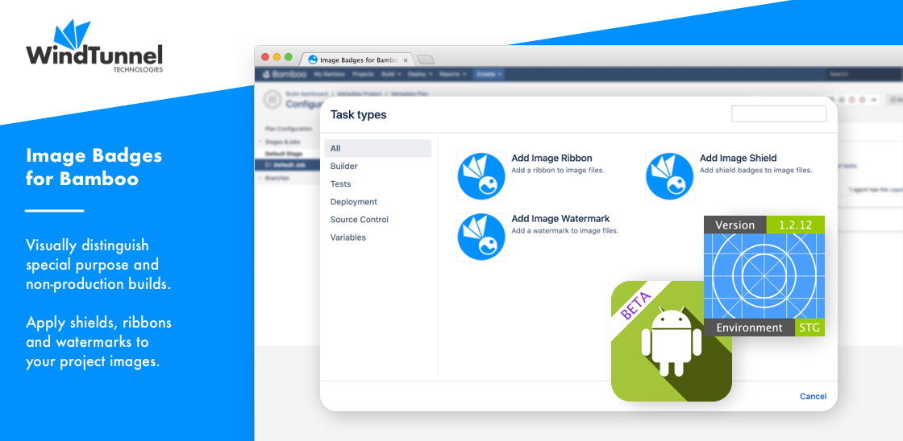

# Home

<kbd></kbd>

The [Image Badges for Bamboo](https://marketplace.atlassian.com/apps/1223693/image-badges-for-bamboo) plugin allows modification of image assets as part of your application build pipeline.
Some of the common use- cases include:

- Adding the application version to the app icon or logo, ensuring testers act on the latest build.
- Adding a watermark to the application background images, making sure unlicensed builds are easily spotted.
- Adding an 'alpha' or 'beta' ribbon to the loading- or splash screen, facilitating correct bug reporting by early adopters.

The plugin features:

- Easy targeting of multiple sets of images using Ant path expressions.
- No dependencies on external web services or command-line tools, fully self-contained.
- Support for PNG, JPG and BMP, with additional formats forthcoming.

Missing a feature? Please [let us know](../common/support.md) and we'll make it work.
