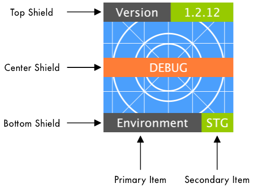

# Add Image Shield

- [General](/tasks/image_shield?id=general)
- [Options](/tasks/image_shield?id=options)
- [Advanced Options](/tasks/image_shield?id=advanced-options)

## General

The 'Add Image Shield' task allows adding up to three shields to an image in the positions *Top*, *Center* and *Bottom*,
as illustrated in the image below. Each shield has a *Primary item*, and optionally a *Secondary item*, making for a maximum
total of six configurable items.

<kbd></kbd>

## Options

***Source files***

Selects the files to process.
The field accepts one or more relative paths or [Ant expressions](https://confluence.atlassian.com/fisheye/pattern-matching-guide-960155410.html).
The task will print each matching file to the build logs for verification.

***Primary item***

Enables or disables the shield primary item. When this checkbox is disabled, no shield will be rendered in this position.

***Text***

The text as show in the shield item. This field accepts dynamic values in the form of Bamboo variables.

***Text color***

Color of the text in hexadecimal format. The accepted formats are (#)RGB, (#)RRGGBB and (#)RRGGBBAA, the latter allowing
specification of transparency.

This field is optional, and the default value is #FFFFFF (white).

***Background color***

Color of the shield item background in hexadecimal format. 

This field is optional, and the default value is #555555 (dark grey) for the primary item and #97CA00 (green) for the secondary item.

***Secondary item***

Enables or disables the shield secondary item. The secondary item can only be enabled when the primary item is enabled.

## Advanced Options

***Ignore warnings***

This allows the build to continue in light of recoverable issues.
For example, selecting an image with a non-supported format is considered a warning.

The default is not to ignore any warnings, as they most often stem from faulty task configuration.

***Working subdirectory***

Optional relative path, which will be prefixed to any path or expression as defined in the *Source files* field.