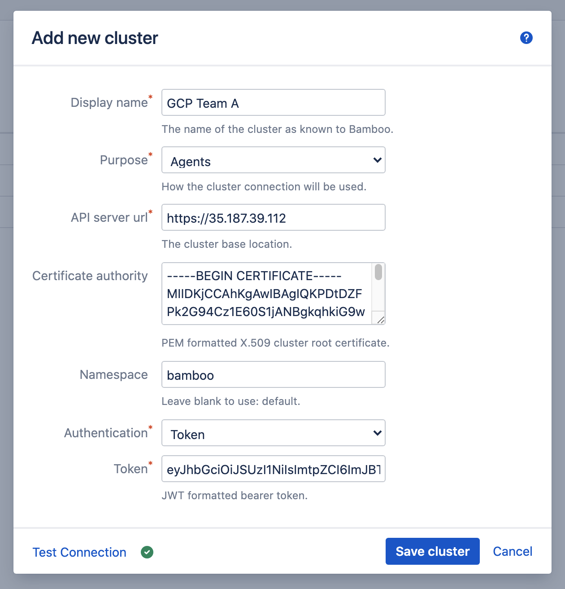
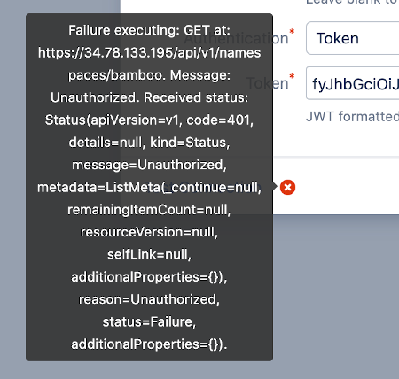
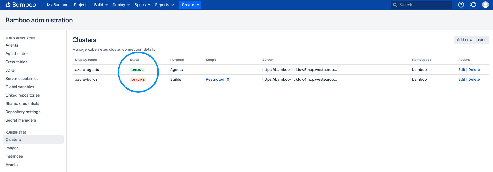
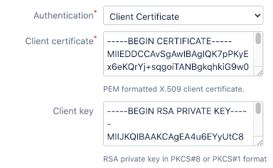
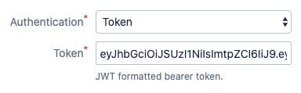

# Clusters

- [Assumptions](/administration/clusters/clusters.md?id=assumptions)
- [Baseline Configuration](/administration/clusters/clusters.md?id=baseline-configuration)
- [Administration](/administration/clusters/clusters.md?id=administration)
- [Authentication](/administration/clusters/clusters.md?id=authentication)
    - [Client Certificate](/administration/clusters/clusters.md?id=client-certificate)
        - [Certificate Signing Request](/administration/clusters/clusters.md?id=certificate-signing-request)
        - [Submit and Approve](/administration/clusters/clusters.md?id=submit-and-approve)
        - [Fetch Client Certificate](/administration/clusters/clusters.md?id=fetch-client-certificate)
    - [Token](/administration/clusters/clusters.md?id=token)

## Assumptions

The correct functioning of the plugin is based on certain assumptions about the clusters on which it operates, as listed below.
Having these assumptions makes the plugin opinionated, but reduces the complexity of the plugin and its configuration.

> As the capabilities of the plugin change over time, so will these assumptions evolve.
> It is our intention to have as little assumptions as possible, making the plugin broadly applicable.

- The Kubernetes version of the cluster is at least 1.9.0 (and at most 1.19.1).

- Each (worker) node in the cluster is provisioned with at least 500MB of RAM and 0.25 vCPU. This caters for the execution of the smallest instance of a single agent Pod.
Going lower on (multiples of this amount of) RAM could result in the agent containers crashing, and is not supported by the plugin.

- The cluster uses auto-scaling. This is not a strict requirement, but it is important to understand that the plugin will not perform
any kind of node provisioning or de-provisioning. It only manages Pods, Secrets and PersistentVolumeClaims (PVC's), so when new agents (i.e. Pods) are scheduled on the cluster,
the cluster itself should react by adding capacity as needed (and vice-versa when Pods are deleted).

- The cluster has defined at least one StorageClass with a PersistentVolume provisioner. As such, the plugin can manage and bind
PersistentVolumeClaims (PVC's) without having to know any specifics on the underlying technology.

## Baseline Configuration

Most instructions in this documentation are based on the assumption of a *baseline configuration* of the cluster,
as detailed below. This configuration can be applied to your cluster as given, or provided instructions can be
adjusted to cater for your specific environment.

The *baseline configuration* creates an isolated Namespace *bamboo*,
with a Service Account (SA) *bamboo* having all permissions needed to at least fully manage PVC's and Pods within the Namespace.

To this end, the following resources are created.

1. A *bamboo* Namespace:

```
apiVersion: v1
kind: Namespace
metadata:
  name: bamboo
```

2. A *bamboo* SA, in the *bamboo* Namespace:

```
apiVersion: v1
kind: ServiceAccount
metadata:
  name: bamboo
  namespace: bamboo
```

3. A Role named *full-access*, in the *bamboo* Namespace:

```
kind: Role
apiVersion: rbac.authorization.k8s.io/v1beta1
metadata:
  name: full-access
  namespace: bamboo
rules:
  - apiGroups: ["", "extensions", "apps"]
    resources: ["*"]
    verbs: ["*"]
  - apiGroups: ["batch"]
    resources:
      - jobs
      - cronjobs
    verbs: ["*"]
```

4. A Role-Binding named *full-access-binding*, binding *full-access* to the *bamboo* SA in the *bamboo* Namespace:

```
kind: RoleBinding
apiVersion: rbac.authorization.k8s.io/v1beta1
metadata:
  name: full-access-binding
  namespace: bamboo
subjects:
  - kind: ServiceAccount
    name: bamboo
    namespace: bamboo
  - kind: User
    name: bamboo
    namespace: bamboo
roleRef:
  apiGroup: rbac.authorization.k8s.io
  kind: Role
  name: full-access
```

## Administration

Cluster management is done from the *Kubernetes Agents* > *Clusters* Bamboo administration page. Add a new cluster by clicking the *Add new cluster*
button in the top-right corner of the page. The *Add new cluster* dialog appears.

<kbd></kbd>
 
The different fields can be completed as follows.

***Display Name***

A descriptive, free-form name which is used to distinguish this cluster from others within the Bamboo installation.

***Purpose***

Each cluster connection has a *purpose*, which can be one of:

- *Agents*: the cluster is used to host Bamboo agents (see [instances](/administration/instances/instances.md)).
- *Builds*: the cluster can be used from Bamboo builds and deployments (see [cluster task](/tasks/cluster.md))

Once a cluster connection is created, its *purpose* can no longer be changed.

***API server url***

The base location of the cluster API server, running on the master node. This is the *cluster > server* value as present in a *~/.kube/config* file.

***Certificate authority***

This is an optional value, but for security reasons strongly advised to provide. It allows Bamboo to verify the TLS-certificate signature presented by
the API-server against the cluster Root Certificate Authority (CA), preventing man-in-the-middle attacks.

This is the base64-encoded or -decoded value of the *cluster > certificate-authority-data* value as present in a *~/.kube/config* file.

***Namespace***

The cluster namespace in which the plugin can operate. This is an optional value. When left empty the *default* namespace is assumed.

***Authentication***

Kubernetes offers clients different authentication strategies. Depending on the strategy, other credential types are required.
The different strategies as supported by the plugin are [explained below](/administration/clusters/clusters.md?id=authentication).

Before the cluster is saved, the connection can be tested. When the connection fails, hover over the crossmark icon to reveal the cause.

<kbd></kbd>

Once the cluster is saved, it is shown in the overview from where it can be edited and deleted.

The plugin will regularly verify the state of each cluster connection. This state is shown in the cluster overview, and is automatically refreshed:

<kbd></kbd>

State transitions are also stored in the plugin [Events](/administration/events/events.md) log.

## Authentication

The sections below describe the different cluster [authentication strategies](https://kubernetes.io/docs/reference/access-authn-authz/authentication/) available.

### Client Certificate

This authentication method refers to the [x509 Client Certs](https://kubernetes.io/docs/reference/access-authn-authz/authentication/#x509-client-certs) authentication strategy.

Creating a client certificate for the *bamboo* SA (and any other SA for that matter) follows a three-step process:

- Generate a key-pair and a Certificate Signing Request (CSR)
- Submit the CSR to the cluster, and have it approved
- Fetch the client certificate signed by the cluster Root Certificate Authority (CA)

These steps are detailed in the sections below.

> The provided instructions assume the availability of [openssl](https://www.openssl.org/) and the [envsubst](https://linux.die.net/man/1/envsubst) tool
> (which is part of the [gettext](https://www.gnu.org/software/gettext/) package). Please adjust instructions as needed for your platform.

#### Certificate Signing Request

Start by generating a key-pair:

```
$ openssl genrsa -out ./bamboo.key 4096
```

Next, store the following CSR configuration options in a file *csr_bamboo.cnf*:

```
[req]
default_bits = 2048
prompt = no
default_md = sha256
distinguished_name = dn

[dn]
CN = bamboo
O = bamboo

[v3_ext]
authorityKeyIdentifier=keyid,issuer:always
basicConstraints=CA:FALSE
keyUsage=keyEncipherment,dataEncipherment
extendedKeyUsage=serverAuth,clientAuth
```

Which is used to generate the CSR:

```
$ openssl req -config ./csr_bamboo.cnf -new -key ./bamboo.key -nodes -out ./bamboo.csr
```

#### Submit and Approve

The CSR is submitted to the cluster as a *CertificateSigningRequest* resource. Store the following specification in *csr_bamboo.yml*:

```
apiVersion: certificates.k8s.io/v1beta1
kind: CertificateSigningRequest
metadata:
  name: bamboo
spec:
  groups:
    - system:authenticated
  request: ${BASE64_CSR}
  usages:
    - digital signature
    - key encipherment
    - server auth
    - client auth
```

This specification contains a variable *BASE64_CSR*, which must hold the base64-encoded value of the CSR. Store this value in an environment
variable with the same name:

```
$ export BASE64_CSR=$(cat ./bamboo.csr | base64 | tr -d '\n')
```

Next, substitute the yml-specification variable with the environment variable value and apply against the cluster:

```
$ cat csr_bamboo.yml | envsubst | kubectl apply -f -
```

Which can be confirmed using:

```
$ kubectl get csr
NAME     AGE   REQUESTOR              CONDITION
bamboo   71s   hello@windtunnel.io    Pending
```

Finally, approve the pending CSR to have the certificate issued:

```
$ kubectl certificate approve bamboo
```

#### Fetch Client Certificate

The signed client certificate can now be fetched, base64-decoded and stored in the file *bamboo.crt*:

```
kubectl get csr bamboo -o jsonpath='{.status.certificate}' | base64 --decode > ./bamboo.crt
```

> Base64-decoding is optional, the field will accept (and decode) a base64-encoded value as well.

This output is the expected value in the cluster configuration *Client certificate* input field.

<kbd></kbd>

The *Client key* fields accepts the content of the key file (*bamboo.key*) as generated in the first step.

### Token

This authentication method refers to the [Service Account Tokens](https://kubernetes.io/docs/reference/access-authn-authz/authentication/#service-account-tokens) authentication strategy.

The default token generated when the *bamboo* SA was created can be retrieved as follows.

> For easy processing of the [kubectl](https://kubernetes.io/docs/tasks/tools/install-kubectl/) output,
> the provided instructions assume the availability of the [jq tool](https://stedolan.github.io/jq/).

First, get the token secret name and store it in the variable *SECRET*: 

```
$ SECRET=$(kubectl get sa bamboo -o json -n bamboo | jq -r .secrets[0].name)
```

Next, request the secret details, extract the token value and store it in the *TOKEN* variable:

```
$ TOKEN=$(kubectl get secret $SECRET -o json -n bamboo | jq -r .data.token)
```

Finally, base64-decode the token value to arrive at its JWT representation (truncated in the output for clarity):

```
$ echo $TOKEN | base64 -d

eyJhbGciOiJSUzI1NiI...asBJVuJ4p9g
```

> Base64-decoding is optional, the field will accept (and decode) a base64-encoded value as well.

This output can now be used in the cluster configuration *Token* input field.

<kbd></kbd>
