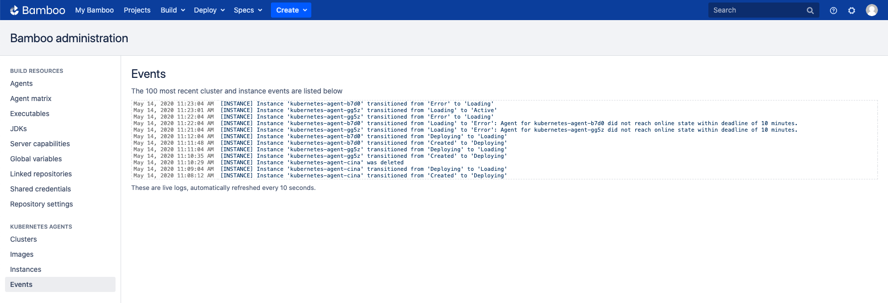

# Events

The events log captures the most recent cluster and instance state transitions, which can assist in diagnosing certain problems.

<kbd></kbd>

The log is automatically refreshed, and the oldest log entries are regularly pruned.