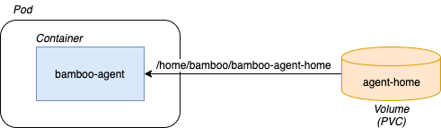
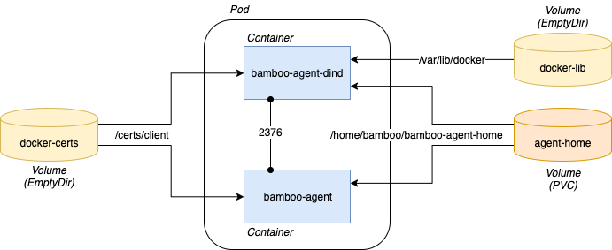
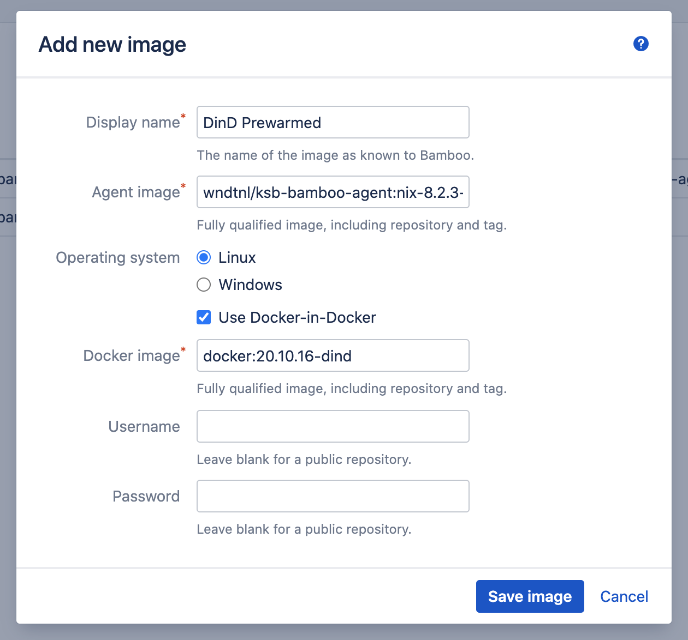
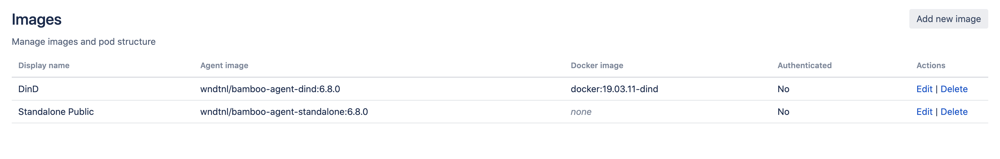

# Images

- [Image Types](/administration/images/images.md?id=image-types)
    - [Standalone](/administration/images/images.md?id=standalone)
    - [Docker-in-Docker](/administration/images/images.md?id=docker-in-docker)
- [Administration](/administration/images/images.md?id=administration)

## Image Types

Depending on the provided Image definition, the corresponding Pod specification will take one of two forms.

### Standalone

The *Standalone* configuration is the default, and includes a single-container Pod with a persisted Agent home folder.
The latter takes the form of a PersistentVolumeClaim, attached to the container as a Volume.
The container image (called the *Agent image*) contains the Bamboo Agent bits and optionally any specific build tools.
This container interacts with the Bamboo server. 

The configuration is schematically illustrated below.

<kbd></kbd>

### Docker-in-Docker 

The *Docker-in-Docker* (DinD) configuration extends the *Standalone* configuration with a second container, responsible for
providing the Docker daemon. The daemon is securely exposed to the primary (build) container over the local network.
The image used by the DinD container is called the *Docker image*.

Hosting the DinD container requires two additional, non-persisted Volumes, as shown below.

<kbd></kbd>

> Using a Docker-in-Docker configuration comes with certain security implications, as the DinD container must run in ***privileged*** mode.
> It is advised not to run DinD Agents in the same cluster where other (production) applications are hosted. 

When using docker-in-docker, please have a look at the [Using Docker Runner](/tutorials/docker_runner) tutorial
for additional instructions.

## Administration

Image management is done from the *Kubernetes Agents* > *Images* Bamboo administration page. Add a new image by clicking the *Add new image*
button in the top-right corner of the page. The *Add new image* dialog appears.

<kbd></kbd>

The different fields can be completed as follows.

***Display Name***

A descriptive, free-form name which is used to distinguish this image from others within the Bamboo installation.

***Agent image***

The fully qualified *Agent image* name and tag, which is used by the *bamboo-agent* container as discussed above.
This image has the same requirements as set by the Atlassian provided
Bamboo agent base image, available at https://hub.docker.com/r/atlassian/bamboo-agent-base. These requirements are as follows:

- The image contains the agent installation files, and starts the agent when the container starts.
- The Bamboo server root url can be provided as the first container argument.
- When the use of a security token is desired, its value is accepted by the container as the environment variable SECURITY_TOKEN.

The easiest way to ensure these requirements are met is to use the base image provided by Atlassian as-is, or to extend its
capabilities [as described](https://hub.docker.com/r/atlassian/bamboo-agent-base). The [Using Docker Runner](/tutorials/docker_runner?id=custom-agent-image) tutorial also provides some guidance.

> IMPORTANT
>
> There is a known issue with Atlassian provided agent images version 7.0 and up. When using these images, the agent might fail to load with
> the following error:
>
> cp: cannot create regular file '.../bamboo-capabilities.properties': No such file or directory
>
> The current workaround is to use an agent image with version <7.0. It is perfectly fine to e.g. use an agent image v6.9 with
> Bamboo v7.X as the agent will synchronize its classpath with the server at startup each time.

***Use Docker-in-Docker***

Allows the specification of a Docker image, and enables a Docker-in-Docker configuration as described above.

***Docker image***

The fully qualified *Docker image* name and tag, which is used by the *bamboo-agent-dind* container as discussed above. This image has the same requirements as the *dind* images available at
https://hub.docker.com/_/docker. Using anything but these officially provided images is advised against as this might interfere with
the correct functioning of the plugin.

***Username & Password***

Allows providing an account to fetch images from a protected, private Docker repository. When these credentials are provided,
the plugin will manage a corresponding [ImagePullSecret](https://kubernetes.io/docs/concepts/containers/images/#specifying-imagepullsecrets-on-a-pod)
in the cluster namespace.

Once the image is saved, it is shown in the overview from where it can be edited and deleted.

<kbd></kbd>

> When editing an image, changes will only be reflected in newly created instances, or instances that went through a deactivate/activate cycle.
> Active instances will not switch instantly to the new image version. This is also indicated in the Edit image dialog.
