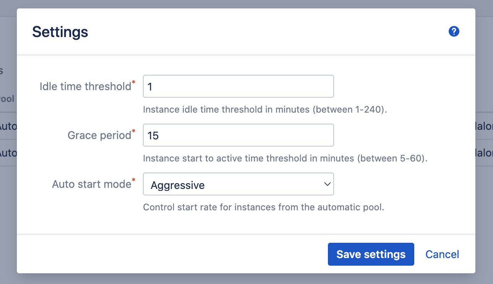

# Instances

- [Background](/administration/instances/instances.md?id=background)
    - [Instance States](/administration/instances/instances.md?id=instance-states)
    - [Instance Actions](/administration/instances/instances.md?id=instance-actions)
    - [Instance Pools](/administration/instances/instances.md?id=instance-pools)
    - [Cluster Resources](/administration/instances/instances.md?id=cluster-resources)
- [Administration](/administration/instances/instances.md?id=administration)
- [Settings](/administration/instances/instances.md?id=settings)

## Background

An instance is defined by an [Image](/administration/images/images.md) and is linked to a specific [Cluster](/administration/clusters/clusters.md).
Instances represent and manage the collection of [cluster resources](/administration/instances/instances.md?id=cluster-resources)
and the corresponding remote agents registered with Bamboo.

### Instance States

Each instance maintains two states: a *desired state* and a *current state*.
The desired state can be controlled by user actions, and can be one of *Active*, *Inactive* or *Deleted*.
The current state depends on the environment, is controlled by the plugin, and reflects the actual state of the instance working towards the desired state.
Current states are a superset of the desired states, and additionally include the *Created*, *Deploying*, *Loading* and *Error* state.

The plugin runs a tight control loop to ensure the current state converges to the desired state at all times.

The different states are detailed below.

- ***Created***: the state immediately after the instance has been created. The instance has been saved to the internal database.
- ***Deploying***: PVC and Pod specifications (and optionally the ImagePullSecret) have been submitted to the cluster. The plugin is waiting for the agent to register with Bamboo.
- ***Loading***: the agent has registered with Bamboo, but is not considered active yet. In this state, the agent will synchronize its classpath
with the Bamboo server as needed, which could take several minutes for an initial load.
- ***Active***: the agent is registered with Bamboo, online and enabled, meaning it is capable of accepting builds from the queue.
When the instance is in this state for the first time, it is also the point at which its agent capabilities are known to Bamboo.
- ***Inactive***: the agent is registered but offline and disabled in Bamboo, meaning it will no longer accept builds from the queue.
The agent Pod has been deleted in the cluster, but the corresponding PVC is still available.
- ***Error***: each state can transition to the *Error* state at any time. An error can be temporarily or permanent, and can be auto-resolvable or
require manual intervention.

### Instance Actions

A total of six actions can be performed on each instance:

- ***Create***: executed only once during the instance lifetime by completing the instance creation dialog.
When creating the instance, the instance *desired state* can be kept *Inactive*, or immediately set to *Active*.
- ***Stop***: can be executed on an instance for which the *desired state* is *Active*. As a result, the *desired state* of the instance is set to *Inactive*.
The plugin will cancel any running builds on the agent, disable the agent, take it offline and delete the corresponding Pod in the cluster.
- ***Start***: can be executed on an instance for which the *desired state* is *Inactive*. As a result, the *desired state* of the instance is set to *Active*.
The plugin will (re)create the corresponding Pod in the cluster and mount the existing PVC, after which the instance follows the same path as during creation.
- ***Edit***: can be executed on an instance for which the *desired state* is *Inactive*, and the *current state* is *Created* or *Inactive*.
When editing an existing instance, only a select number of fields can be adjusted (linked to the pod specification).
When saving the instance, the instance *desired state* can be kept *Inactive*, or immediately set to *Active*.
- ***Delete***: executed only once during the instance lifetime. Can be executed in every combination of desired and *current state*, and results in the complete deletion of all
cluster resources as well as the remote agent in Bamboo. Any running builds are cancelled.
- ***Purge***: can be executed when the *desired state* is *Deleted*, but the *current state* is *Error*. This can happen (for example) when the cluster in which the instance
was deployed no longer exists. As a consequence, the plugin can no longer (and should not) control any cluster resources. Purging the instance ensures the instance definition is
removed from the Bamboo database.

### Instance Pools

Each instance must be assigned to a pool, which determines its lifecycle behaviour. A total of three pool types are available:

- ***Manual***: the instance is started and stopped manually by Bamboo Administrators. The plugin will never interfere.
- ***Task***: the instance can be used from dedicated [Bamboo tasks](/administration/tasks/tasks.md), which can control the instance *desired state*.
Instances from this pool can optionally auto-inactivate.
- ***Automatic***: the plugin automatically selects and controls instances from this pool based on the build queue pressure and requirements.

Instances from the Tasks and Automatic pool can still be manually started and stopped by the Bamboo Administrator if needed,
but this might interfere with the actions taken by the system.

### Cluster Resources

Each instance represents exactly one PVC, one Pod and optionally one Secret (i.e. ImagePullSecret) in the linked cluster.

***PersistentVolumeClaim***

The PVC has the same name as the instance, and is used to persistently store the Bamboo agent home directory.
Because the PVC is retained during instance active/inactive (start/stop) cycles,
the agent can quickly re-activate after the initial warm-up (first *Created* to *Active* transition).

***Pod***

The Pod has the same name as the instance, and contains a single container running the instance image.
The Bamboo server root url and security token are injected as needed.

The pod is annotated with the following labels:

- ***ksb.windtunnel.io/name***: with example value *kubernetes-agent-xf5s*.
- ***ksb.windtunnel.io/instance***: with example value *4d349572-9ac7-4cb5-ae23-8a08d9c6c1f4*. This is the primary database key of the instance.
- ***ksb.windtunnel.io/managed-by***: with value *bamboo*.
- ***ksb.windtunnel.io/server-id***: with example value *BV68-45ZM-VWHH-55F0*. This is the Atlassian server id, as used for licensing purposes.

The plugin will only manage Pods where these four labels exist and contain the expected values, so it is advised not to change them manually.
When the plugin cannot find the Pod it expects, the control loop will create a new Pod as to achieve the *desired state*.

***ImagePullSecret***

When the [Image](/administration/images/images.md) defines credentials, the plugin will ensure a corresponding ImagePullSecret is
defined in the cluster.

## Administration

Instance management is done from the *Kubernetes Agents* > *Instances* Bamboo administration page. Add a new instance by clicking the *Add new instance*
button in the top-right corner of the page. The *Add new instance* dialog appears.

<kbd></kbd>

The different fields can be completed as follows.

***Instance prefix***

Used to define the name of the instance, the agent, the PVC and Pod. This is an optional field. When left empty the default *kubernetes-agent* is used.
Each instance name consists of the chosen prefix, appended with a random 5-digit suffix ensuring uniqueness.

***Cluster***

Dropdown with previously defined [clusters](/administration/clusters/clusters.md).

***Image***

Dropdown with previously defined [images](/administration/images/images.md).

***Pool***

The [pool](/administration/instances/instances.md?id=instance-pools) to which the instance will be allocated.

When choosing the *Task* pool, it is possible to control the idle behaviour using the *Stop when idle* option (selected by default).
Selecting this option implies the instance will be automatically deactivated when idle for a certain time, similarly to the instances in the *Automatic* pool.
This has the advantage that it is not necessary to explicitly stop the instance from a Task when no longer needed.

***Size***

The size of the instance in terms of CPU and RAM usage in the cluster.
These numbers correspond to the *request* amount of the Pod specification. The *limit* amount will be set to twice the *request* amount.
In a Docker-in-Docker configuration, the given amount will be split 3/4th to 1/4th between the agent container and the DinD container respectively.

***Storage size***

The storage size allocated to the PVC in GB. This determines the size of the Agent home folder. The default value is 10GB.

***Storage class***

The storage class used by the PVC. When left blank, the PVC will use the default storage class of the cluster, i.e. the class
annotated with *storageclass.kubernetes.io/is-default-class: true*.

***Spec merge***

This optional field accepts a YAML snippet which will be merged with the pod specification (the *spec* section) of the instance as generated by the plugin.
Refer to the [Adjust Agent Pod Spec](/tutorials/agent_pod_spec.md) tutorial for additional information and examples.

An instance can be created, or created and immediately started. The difference is the intial value of the *desired state*, which will be
*Inactive* or *Active* respectively.

> It is advised to start each newly created instance at least once, as it allows to very that the instance can indeed successfully activate.
> It furthermore registers the Agent capabilities with Bamboo, which is a required prerequisite for instances in the *Automatic* pool.  

Once the instance is saved, it is shown in the overview from where it can be started, stopped and deleted.

<kbd></kbd>

The desired and current states are shown in the instance overview, and are automatically refreshed.
When an instance enters the *Error* state, hover over its label to reveal the cause:

<kbd></kbd>

Each state transition, including errors, are also stored in the plugin [Events](/administration/events/events.md) log.

## Settings

Global instance settings can be managed from the *Settings* dialog on the *Instances* Bamboo administration page.

<kbd></kbd>

The following settings are avaiable.

***Idle time threshold***

This setting controls how long the plugin waits after instance inactivity (i.e. no builds or deploys being executed by the corresponding Agent),
before shutting it down. The setting applies to instances in the *Automatic* pool, as well as instances in the *Task* pool having the *Stop when idle* option set.

***Grace period***

This setting only applies to instances in the *Automatic* pool. It determines the time the plugin will wait between transitioning the *desired state*
to *Active*, and the *current state* becoming *Active*. When the instance does not reach the *Active* state within the grace period, the plugin
assumes something is wrong and deactivates the instance as to prevent holding on to useless (cloud) resources or Bamboo agent licenses.

Note that instances in the *Task* pool have a similar setting on the task configuration.

***Auto start mode***

This setting only applies to instances in the *Automatic* pool. It determines the rate at which the plugin will schedule
new instances to start based on builds being added to the build queue.

- *Conservative*: if an instance is already deploying or loading which can handle the build, the plugin will refrain from starting a new instance.
- *Aggressive*: a new instance will always be selected to start if it can handle the build, independent of the state of other instances.
