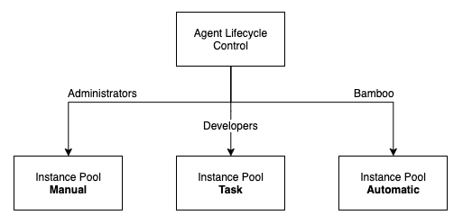
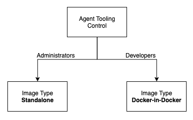

# The Big Picture

The primary aim of the plugin is to enable frictionless management of Bamboo Agents deployed as Pods on [Kubernetes](https://kubernetes.io) clusters.
Combining the flexibility of Kubernetes with the distinct capabilities of the plugin provides a number of operational advantages, as discussed below. 

## Cost Reductions

Cost reductions in terms of (cloud) compute resources can be achieved by leveraging:

- Preemptible / Spot VM instances (e.g. [Google](https://cloud.google.com/compute/docs/instances/preemptible), [Azure](https://azure.microsoft.com/en-us/pricing/spot), [AWS](https://aws.amazon.com/ec2/spot)):
the plugin runs a tight control loop to ensure that [Instances](/administration/instances/instances.md) (i.e. Bamboo Agents) that should be active are actually deployed on the cluster.
When a cluster node is terminated (which could be a regular event) and the corresponding Pod disappears, the plugin will ensure the same Pod specification is re-deployed on the cluster. Because Agent state is
stored on a Persistent Volume (PV), the Agent maintains its identity in Bamboo. From the perspective of the Bamboo server, it appears as if nothing happened. 
- Cluster autoscaling (e.g. [Google](https://cloud.google.com/kubernetes-engine/docs/concepts/cluster-autoscaler), [Azure](https://docs.microsoft.com/en-us/azure/aks/cluster-autoscaler), [AWS](https://docs.aws.amazon.com/eks/latest/userguide/cluster-autoscaler.html)):
the plugin can automatically deactivate idle Instances. Instance deactivation deletes the corresponding Pod from the cluster,
allowing the cluster to scale back on excessive nodes where appropriate. No longer will needless resources be consumed at night, during weekends or holidays.

The plugin will furthermore minimize the required Bamboo License tier in terms of Remote Agents, as the number of *defined* Instances
will typically far exceed the number of instantly *active* Instances (i.e. 'Online Agents').

## Agent Lifecycle Control

Normally the lifecycle of each Bamboo Agent is manually controlled by the Bamboo Administrator. By means of assigning Instances to distinct *Instance Pools*,
the plugin adds additional lifecycle options:

- ***Manual Pool***: instances in the manual pool are exclusively controlled (i.e. activated and deactivated) by Administrators, and are as such equivalent to the existing situation.
- ***Task Pool***: instances in the task pool can be activated, and optionally deactivated, using specialized Bamboo Tasks. 
This allows dedicating certain Instances to a particular project or team, with the team having control over the lifecycle of the Instances. 
Activation of such Instances is bound to the execution of a build.
- ***Automatic Pool***: instances in the automatic pool are fully controlled by the plugin itself. By monitoring the build queue and calculating the optimal mapping between Jobs and Instances,
the plugin ensures the right Instances are activated at the right time. Combined with auto-inactivation, the plugin ensures Instances are only active when needed.

These three options are illustrated in the schema below.

<kbd></kbd>

## Agent Tooling Control

Instances are linked to [Image](/administration/images/images.md) specifications. Each image can include its own tooling required to execute certain builds.
An image specification can also opt for a Docker-in-Docker configuration, enabling the use of the [Bamboo Docker Runner](https://confluence.atlassian.com/bamboo/docker-runner-946020207.html).
These options give great flexibility both to Administrators as well as Developers in terms of crafting specialized Instances, even for builds that are only rarely executed.

<kbd></kbd>