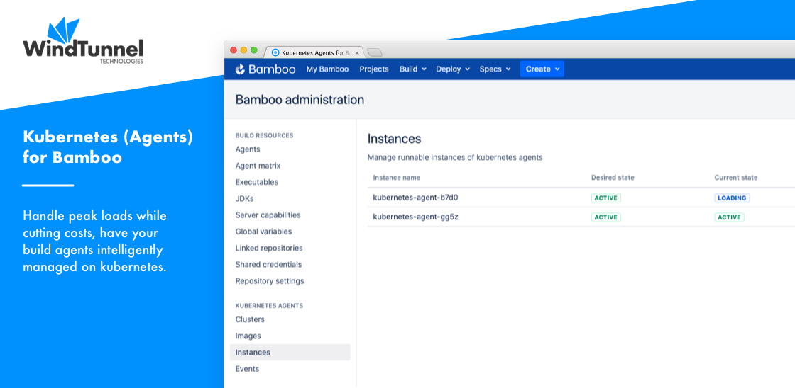

# Home

<kbd></kbd>

The [Kubernetes for Bamboo](https://marketplace.atlassian.com/apps/1222674/kubernetes-agents-for-bamboo) plugin includes the
following features:

- Start and stop Bamboo Agents manually, using Bamboo tasks or fully automated.
- No dependency on *kubectl*, and simultaneous support for multiple clusters.
- Support for private image repositories.
- Support for Docker-in-Docker configuration and thus the [Bamboo Docker Runner](https://confluence.atlassian.com/bamboo/docker-runner-946020207.html).
- Support for [agent security token verification](https://confluence.atlassian.com/bamboo/agent-authentication-289277196.html#Agentauthentication-SecuritytokenverificationSecuritytokenverification) and [authentication](https://confluence.atlassian.com/bamboo/agent-authentication-289277196.html#Agentauthentication-Authenticatingremoteagents).
- Full audit trail and event log.

In addition, more general tasks for cluster interaction are provided:

- Downloading [kubectl](https://kubernetes.io/docs/reference/kubectl/kubectl) and [helm](https://helm.sh) binaries.
- Writing cluster configuration to a kubeconfig file.

Please read [The Big Picture](big_picture.md) first sketching the high-level context,
after which the [Administration](/administration/) pages will provide in-depth discussions.

If questions remain after working through this documentation, please reach out through our [Support](../common/support.md) page.