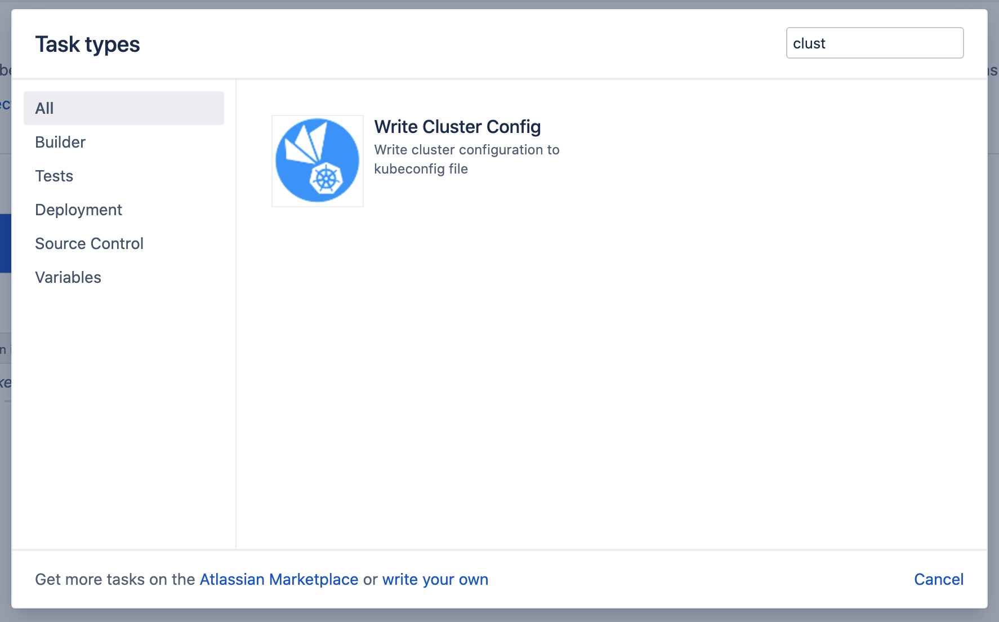
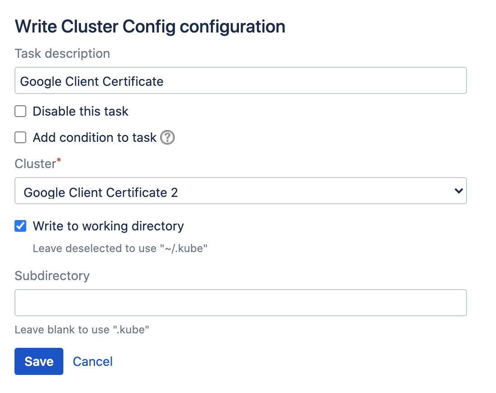

# Cluster Tasks

- [General](/tasks/cluster.md?id=general)
- [Example](/tasks/cluster.md?id=example)

## General

Clusters defined in the [administrative section](/administration/clusters/clusters?id=administration) with purpose *Builds*
are available to the *Write Cluster Config* task.

This task allows dumping the cluster configuration to a [kubeconfig](https://kubernetes.io/docs/concepts/configuration/organize-cluster-access-kubeconfig) file,
used by tools such as [kubectl](https://kubernetes.io/docs/reference/kubectl/kubectl) and [helm](https://helm.sh) to interact with a cluster.

> As an important point to consider: this task will replace any existing kubeconfig file in its entirety in the selected location.
> Take care not to overwrite any existing file with cluster connection details which cannot be restored. 

The task can be selected from the *Task types* dialog.

<kbd></kbd>

The available settings are shown below.

<kbd></kbd>

***Cluster***

Select one of the clusters with purpose *Builds*.

> Clusters with purpose *Agents* are not available from this task, as they are considered isolated and only available for interaction
> by Bamboo itself. It is advised to create at least a different namespace and identity (authentication details) for connections with
> different purposes.

***Write to working directory***

When this checkbox is deselected (the default), the task writes the config to the *.kube* folder below the home folder of the
current user (i.e. *~/.kube/config*). This is the default location tools such as *kubectl* and *helm* look for a cluster context,
and as such requires no further configuration.

If however writing to the *~/.kube/config* location is not possible or undesired, check this box to write the *config* file relative
to the task working directory. 

***Subdirectory***

This is an optional field, only available when the *Write to working directory* checkbox is selected. When left empty, the
task will write the cluster configuration to *.kube/config* relative to the task working directory. Specify a value to select
a different subdirectory.

## Example

An example *kubeconfig* as generated from a cluster configuration is listed below. In this case, the cluster CA was provided and
token authentication used. A single *context* is defined, which is by default the *current-context*.

```
---
apiVersion: "v1"
kind: "Config"
clusters:
- cluster:
    certificate-authority-data: "LS0tL...Q0FURS0tLS0tCg=="
    server: "https://35.187.39.112"
  name: "6d735ef1-08b7-4acd-89da-8e883a99063a"
contexts:
- context:
    cluster: "6d735ef1-08b7-4acd-89da-8e883a99063a"
    namespace: "bamboo"
    user: "6d735ef1-08b7-4acd-89da-8e883a99063a"
  name: "6d735ef1-08b7-4acd-89da-8e883a99063a"
current-context: "6d735ef1-08b7-4acd-89da-8e883a99063a"
users:
- name: "6d735ef1-08b7-4acd-89da-8e883a99063a"
  user:
    token: "eyJhbG..._w-SSlFb_4lE2CrdZS7bQ"
```
