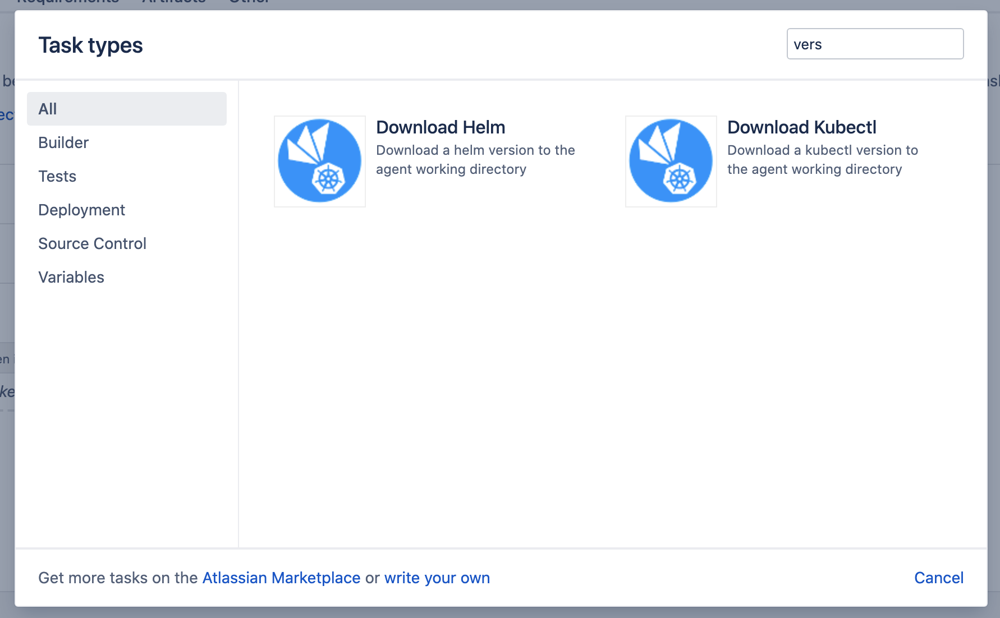
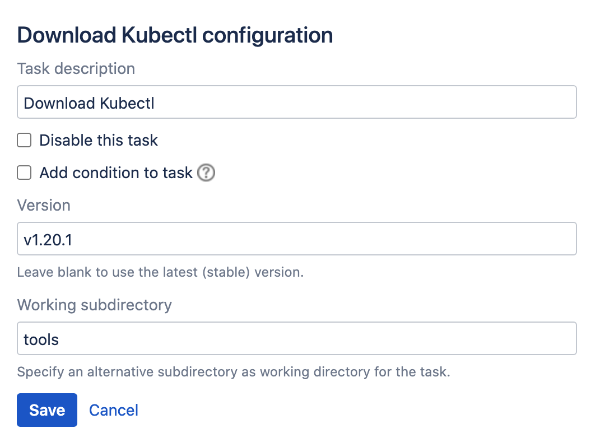

# Download Tasks

The plugin includes two tasks for downloading [kubectl](https://kubernetes.io/docs/reference/kubectl/kubectl)
and [helm](https://helm.sh) binaries to the agent working directory. These binaries are fetched from the official channels, being:

- kubectl: https://storage.googleapis.com/kubernetes-release/release 
- helm: https://github.com/helm/helm/releases

The tasks can be selected from the *Task types* dialog.

<kbd></kbd>

Both tasks have the same settings, as shown below.

<kbd></kbd>

***Version***

This is an optional field. When not provided, the task will fetch the latest (stable) version as determined by:

- kubectl: https://storage.googleapis.com/kubernetes-release/release/stable.txt
- helm: https://github.com/helm/helm/releases/latest

The resolved version is always printed in the build logs.

***Working subdirectory***

This is an optional field, and allows specifying a subdirectory relative to the task working directory
to download the binary into.