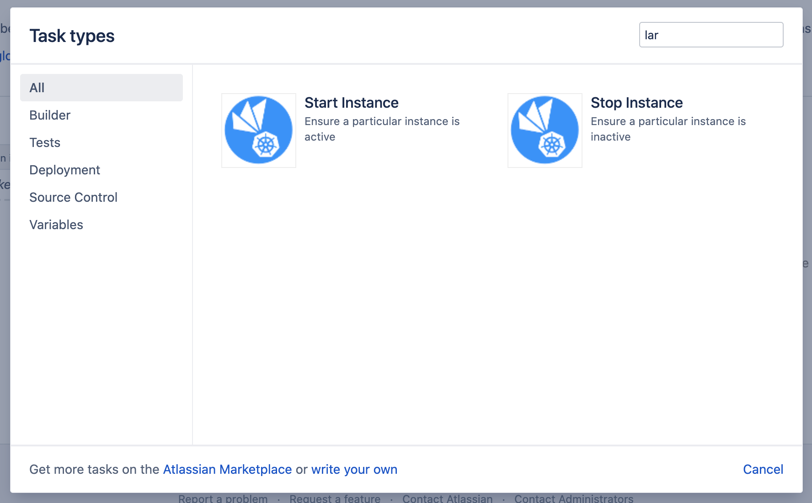
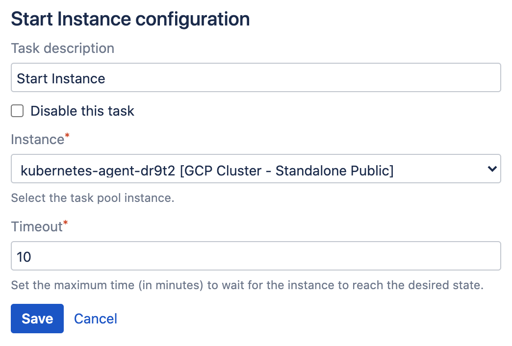
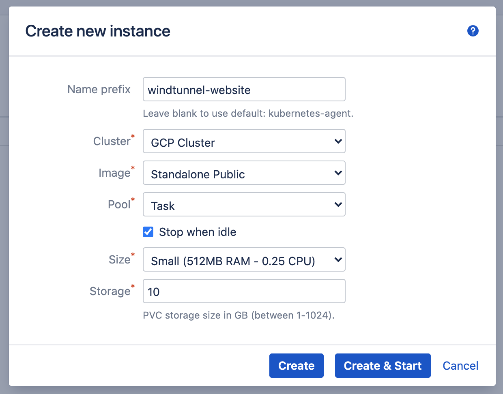
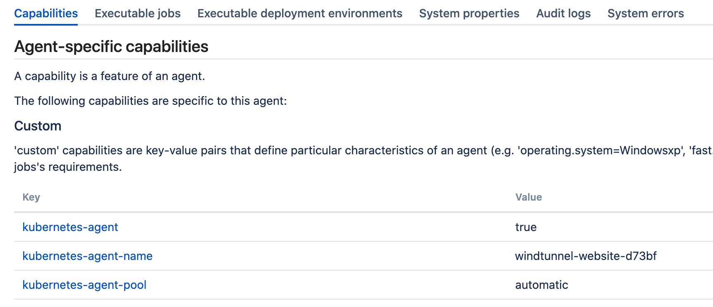
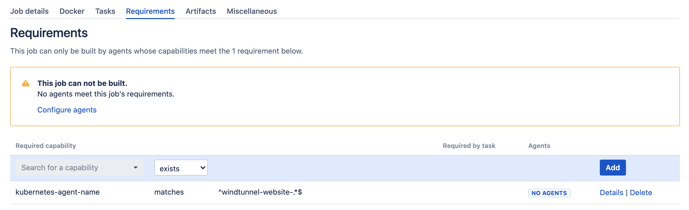
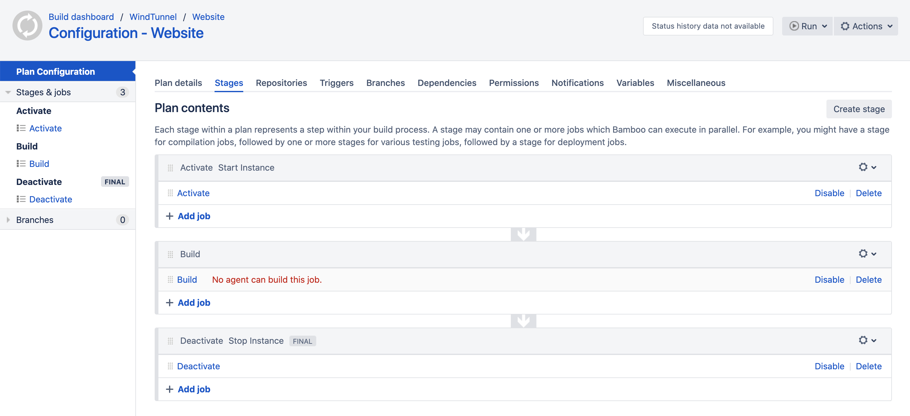

# Instance Tasks

- [General](/tasks/instance.md?id=general)
- [Example](/tasks/instance.md?id=example)

## General

> IMPORTANT - DEPRECATION WARNING
> 
> With the release of [Bamboo 9.6](https://confluence.atlassian.com/bambooreleases/bamboo-9-6-release-notes-1376026732.html) Atlassian
> has fully removed the possibility to define and run tasks on local agents. As it stands, the instance tasks of this plugin require execution
> in the context of the server and as such can no longer be used. Using an instance task on Bamboo 9.6+ will fail the build and result in
> the following error 'Instance tasks should not be executed on a remote agent'.
>
> While it would technically be possible to convert the instance tasks to allow them to run on remote agents
> (using a communication channel back to the server), we are currently inclined to no longer support these tasks going 
> forth and as a consequence the task instance pool. The use of these tasks is relatively convoluted and any use case is 
> probably better handled by using the automatic pool.
>
> As of May 30th 2024, the plan is to keep the tasks and task pool available as-is for some time to allow for migration if needed,
> but to completely remove them over time. If you would like to discuss, please [reach out](../common/support).

The lifecycle of Instances from the *Task* pool can be controlled by dedicated *Start Instance* and *Stop Instance* Bamboo tasks.
These tasks will control the *desired state* of the Instance, *Active* and *Inactive* respectively, and wait for a maximum duration
till the instance *current state* matches this *desired state*.

Starting and stopping Instances must happen in the context of the Bamboo server. As such, it is not possible to execute these tasks on
a remote agent.

The tasks can be selected from the *Task types* dialog.

<kbd></kbd>

Both tasks have the same settings, as shown below.

<kbd></kbd>

***Instance***

Select one of the Instances available from the *Task* pool.

> Having multiple tasks starting the same Instance will never be a problem, as the task only sets the *desired state* to *Active*
> and verifies the *current state*. When an instance is already *Active*, the task will immediately and successfully complete.
> Having multiple tasks stopping the same Instance might be a problem, as one build plan can interfere with another. One should ensure
> only a single plan controls the lifecycle of the Instance, or alternatively use the *Stop when idle* option on the Task instances to
> ensure the Instance is eventually inactivated.

***Timeout***

The maximum time in minutes the task will wait for the Instance to reach the desired state. When the given timeout is exceeded,
the task will fail the build. Note that the *desired state* is not reverted in this case as to prevent interference with other builds.

## Example

An example setup is herby provided, in which a *Task* pool Instance is dedicated to a certain build plan.

We start by defining the instance, using a non-default name prefix *windtunnel-website*, as shown below.

<kbd></kbd>

When the Instance is activated (and the corresponding Bamboo Agent registers) the plugin will automatically add a number of custom capabilities
to the Agent, including *kubernetes-agent-name* having the Instance name as value.

<kbd></kbd>

This capability can be used to restrict certain jobs to run on a specific Instance, or a group of Instances. An example is given below, where the
job requirements uses the *matches* filter and the regex ```^windtunnel-website-.*$``` to match any Instance/Agent name starting with *windtunnel-website-*.

<kbd></kbd>

Given this, a build plan which controls the lifecycle of an Instance can be structured as follows:

<kbd></kbd>

Here, the plan is structured in three *stages*, running in sequence:

- ***Activate***: the activate stage contains a single job which is pinned to a *Local* Bamboo agent (which can also be done using a custom capability).
This job will contain the *Instance Start* task. Once the *Activate* stage is completed, the selected Instance will be active and the corresponding
build agent online.
- ***Build***: the build stage contains one or more jobs which are pinned to the Instance, as discussed above. As a result of the activate stage,
the jobs in this stage will be able to execute on the given agent (the *No agent can build this job* message will no longer be active).
There is of course no limit to the number of stages that can be added here, as long as the jobs are correctly assigned to the desired Instance.
- ***Deactivate***: the job in this stage is again pinned to a *Local* Bamboo agent, and will contain the *Instance Stop* task matching the Instance
as defined in the *Instance Start* task. This stage is completely optional, and can be avoided when using the *Stop when idle* option on the Instance.


