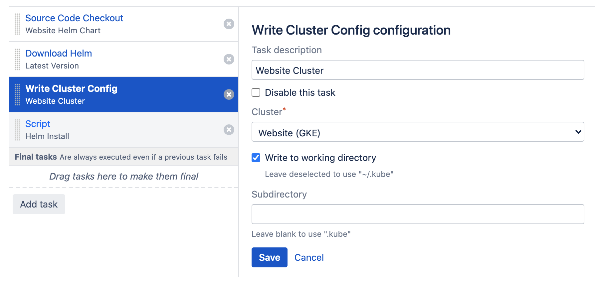

# Deploying a Helm Chart

- [Introduction](/tutorials/deploy_helm.md?id=introduction)
- [Cluster Configuration](/tutorials/deploy_helm.md?id=cluster-configuration)
- [Cluster Connection](/tutorials/deploy_helm.md?id=cluster-connection)
- [Build Configuration](/tutorials/deploy_helm.md?id=build-configuration)
    - [Source Code Checkout](/tutorials/deploy_helm.md?id=source-code-checkout)
    - [Download Helm](/tutorials/deploy_helm.md?id=download-helm)
    - [Write Cluster Config](/tutorials/deploy_helm.md?id=write-cluster-config)
    - [Invoke Helm](/tutorials/deploy_helm.md?id=invoke-helm)
- [Closing Remarks](/tutorials/deploy_helm.md?id=closing-remarks)

## Introduction

In this tutorial, we will look at deploying an application packaged as a [helm](https://helm.sh) chart to a Kubernetes cluster.
As there are many tutorials available regarding the use of helm and the creation of helm charts, we will primarily focus on the
aspects relevant to this plugin.

We assume the deployment of a website, represented by a default [nginx](https://hub.docker.com/_/nginx) image. We have prepared
a public repository at https://github.com/wndtnl/k8s-chart-demo which will be used during this tutorial.

```
$ git clone https://github.com/wndtnl/k8s-chart-demo.git
```

## Cluster Configuration

We start by setting up a namespace (website), service account (website), role (chart-deploy) and role-binding (chart-deploy-binding)
which combined act as an isolated environment within the cluster. The tutorial repository includes a
file called *kubernetes.yaml* which can be applied by a cluster administrator to create these resources.

```
$ kubectl apply -f kubernetes.yaml
    namespace/website created
    serviceaccount/website created
    role.rbac.authorization.k8s.io/chart-deploy created
    rolebinding.rbac.authorization.k8s.io/chart-deploy-binding created
```

The instructions as documented in the [token authentication](/administration/clusters/clusters.md?id=token) section can be used to extract
the default token for this newly created service account.

```
$ SECRET=$(kubectl get sa website -o json -n website | jq -r .secrets[0].name)
$ TOKEN=$(kubectl get secret $SECRET -o json -n website | jq -r .data.token)
$ echo $TOKEN | base64 -d
```

## Cluster Connection

With the cluster configuration in place, we can proceed by defining a new cluster connection in Bamboo as shown below.

Of primary importance is the *Purpose* field of the cluster connection, which must be set to *Builds*. This exposes the
connection to the [Write Cluster Config](/tasks/cluster.md) task.

<kbd></kbd>

Test the connection, and save the cluster.

## Build Configuration

Finally, we create a build plan with 4 tasks as show below. Each task is discussed in the following sections.

<kbd></kbd>

### Source Code Checkout

Regular checkout of the repository containing the chart definition, *https://github.com/wndtnl/k8s-chart-demo.git* in our example.

### Download Helm

This is an optional step and not required if the build agent already contains a helm binary on its path. If not, use the plugin provided
[download task](/tasks/download.md) to install the binary in the agent working directory as part of the build.

### Write Cluster Config

This step will ensure a *kubeconfig* file is present holding the cluster connection details as previously defined. By checking the *Write to working directory*,
the file will be available at *[agent-working-directory]/.kube/config*.

<kbd></kbd>

### Invoke Helm

The last task of the build executes a regular script invoking the helm command. Before running helm, we set the *KUBECONFIG* variable
to the location of the *kubeconfig* file as generated in the previous step. This ensures helm connects to the correct cluster environment
without additional settings.

<kbd></kbd>

Executing the build, when successful, will result in the deployment of the application:

```
26-Dec-2020 12:44:53	Release "website" has been upgraded. Happy Helming!
26-Dec-2020 12:44:53	NAME: website
26-Dec-2020 12:44:53	LAST DEPLOYED: Sat Dec 26 12:44:52 2020
26-Dec-2020 12:44:53	NAMESPACE: website
26-Dec-2020 12:44:53	STATUS: deployed
26-Dec-2020 12:44:53	REVISION: 4
26-Dec-2020 12:44:53	TEST SUITE: None
```

## Closing Remarks

This tutorial oversimplifies the process of deploying an application using a helm chart.
A more production-ready process would include the following additional steps:

- Building, tagging and pushing the (docker) image of the application.
- Versioning, packaging and storing the chart archive.
- Verification, follow-up and automated roll-back of the deployment. 
