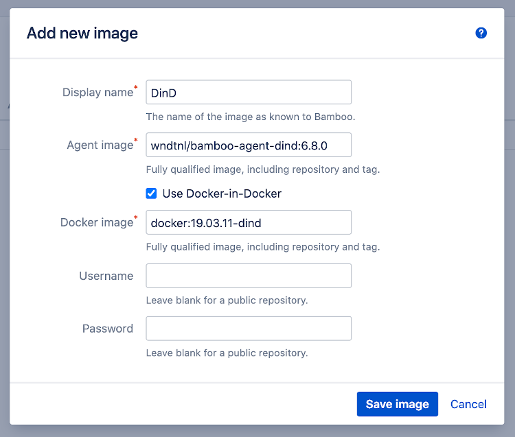
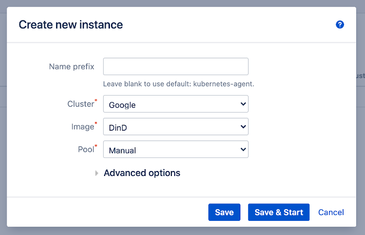
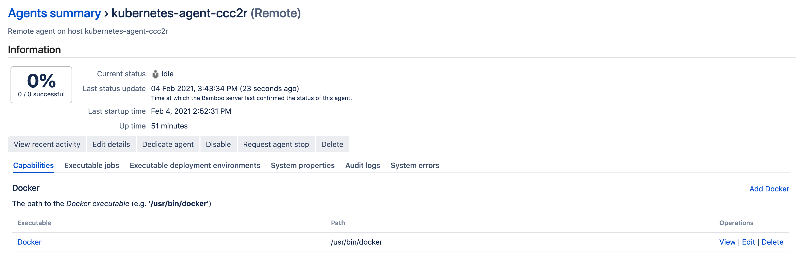
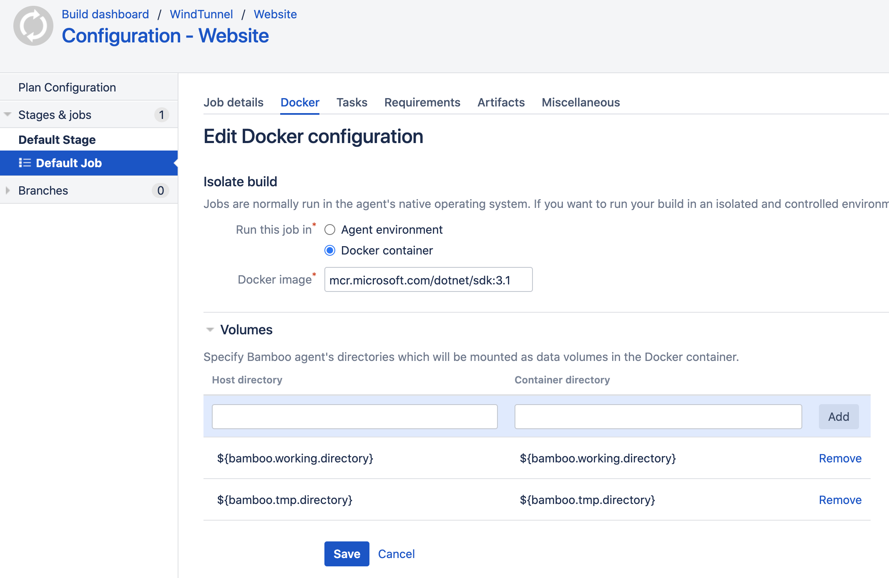
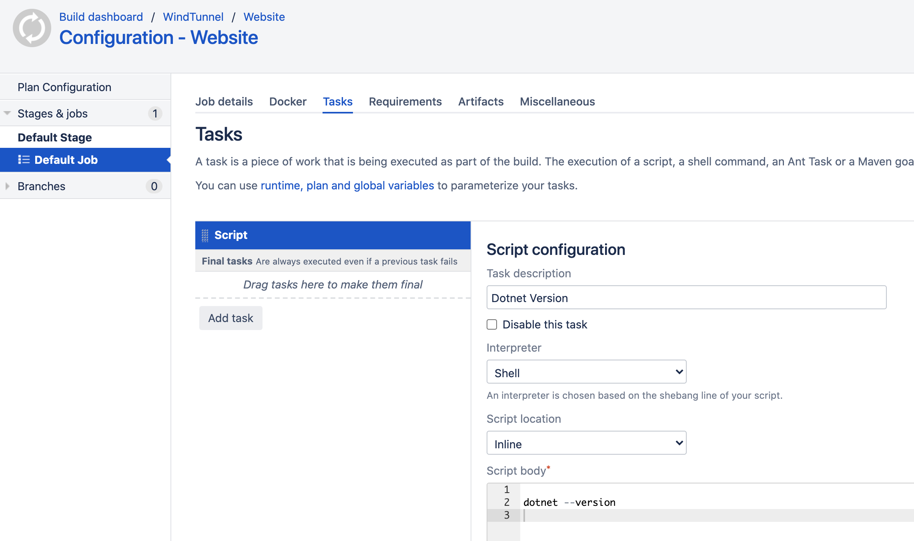

# Using Docker Runner

- [Introduction](/tutorials/docker_runner.md?id=introduction)
- [Agent Image](/tutorials/docker_runner.md?id=agent-image)
- [Create Image](/tutorials/docker_runner.md?id=create-image)
- [Create Instance](/tutorials/docker_runner.md?id=create-instance)
- [Agent Capability](/tutorials/docker_runner.md?id=agent-capability)
- [Configure Build](/tutorials/docker_runner.md?id=configure-build)
- [Troubleshooting](/tutorials/docker_runner.md?id=troubleshooting)
    - [Connection Reset By Peer](/tutorials/docker_runner.md?id=connection-reset-by-peer)

## Introduction
   
The Bamboo [Docker Runner](https://confluence.atlassian.com/bamboo/docker-runner-946020207.html) allows running
builds in a Docker container with an image of choice. This isolates the build from the agent environment
and caters for flexible tooling requirements. The feature requires Docker to be installed on the agent,
allowing Bamboo to instrument the container.

When using this plugin to run Bamboo agents on Kubernetes, the agent itself is already running inside a container.
In order to support Docker Runner in this setup, the environment can be configured as follows:

- the Docker daemon runs in a separate container, which exposes the daemon over the local network on port 2376. This is
handled transparently by the plugin as described on the [images page](/administration/images/images?id=docker-in-docker).

- the Docker CLI is available in the Bamboo agent container and interacts with the Docker daemon over the local network.

The different steps needed to arrive at this configuration, and to use Bamboo Docker Runner with this plugin, are detailed below.
We assume a cluster connection [has been defined](/administration/clusters/clusters?id=administration) beforehand.

## Agent Image

The Docker CLI must be available in the agent environment, which means installing it in the agent image.

We have provided an example on [Github](https://github.com/wndtnl/ksb-bamboo-agent) (see the Dockerfile suffixed with Dind),
as well as pre-built images available on [Dockerhub](https://hub.docker.com/r/wndtnl/ksb-bamboo-agent) (see image tags suffixed with *dind*).

## Create Image

We can now specify a new image on the Kubernetes Agents > Images administration page. We use the following settings:

- Agent image: the image discussed in the previous step.
- Docker image: one of the images available at https://hub.docker.com/_/docker.

These settings are illustrated in the screenshot below.

<kbd></kbd>

## Create Instance

Create and start an instance using the image specified in the previous step, as shown below.

<kbd></kbd>

Once the instance is active, we can confirm its pod contains indeed two containers:

```
$ kubectl get pods -n bamboo

NAME                     READY   STATUS    RESTARTS   AGE
kubernetes-agent-ccc2r   2/2     Running   0          3m50s
```

The container names can be listed as follows:

```
$ kubectl get pods kubernetes-agent-ccc2r -o jsonpath='{.spec.containers[*].name}' -n bamboo

docker bamboo-agent
```

Next, we can shell into the 'bamboo-agent' container, and confirm that the Docker CLI was installed:

```
$ kubectl exec --stdin --tty kubernetes-agent-ccc2r -n bamboo -c bamboo-agent -- /bin/bash

bamboo@kubernetes-agent-ccc2r:~$ docker --version

Docker version 20.10.3, build 48d30b5
```

Finally, we confirm the [DOCKER_HOST](https://docs.docker.com/engine/reference/commandline/cli/#environment-variables)
environment variable was set by the plugin, pointing at the Docker daemon exposed by the *docker* container.
This ensures the Docker CLI will connect to the daemon as expected.

```
bamboo@kubernetes-agent-ldvbx:~$ echo $DOCKER_HOST

tcp://localhost:2376
```

## Agent Capability

Docker Runner requires the availability of Docker on the agent. This requirement is formalized as an
[agent capability](https://confluence.atlassian.com/bamboo/configuring-capabilities-289277148.html), which must be set.
We can confirm that Bamboo has automatically detected the Docker CLI by navigating to the agent summary page.

<kbd></kbd>

## Configure Build

As a final step, we can configure a Bamboo plan to use the Docker Runner. In the example below, the custom
*mcr.microsoft.com/dotnet/sdk:3.1* image is used which contains the *dotnet* executable.

<kbd></kbd>

The build tasks can now be configured as any other build. They will execute in the context of the custom image.

<kbd></kbd>

## Troubleshooting

### Connection Reset By Peer

When using the [Docker-in-Docker](/administration/images/images.md?id=docker-in-docker) agent image configuration, with or without
the Bamboo Docker Runner, your builds might fail with the following error message:
 
```
read tcp [::1]:37862->[::1]:2376: read: connection reset by peer
```

When this happens, the *docker* container in the agent pod was restarted. As a result, the *bamboo-agent* container could (temporarily)
not connect with the docker daemon yielding this error message. The most probable cause for a *docker* container restart is
by hitting the allocated memory resource limit.

Resolving the problem means increasing the memory limit. This can be done by specifying custom resources specifically for the *docker* container, as 
explained on the [Adjusting Agent Pod Spec](/tutorials/agent_pod_spec?id=use-case-custom-resources) page. The limits for the
*docker* container can be increased using the snippet:

```
containers:
  - name: docker
    resources:
      limits:
        cpu: 750m
        memory: 1Gi
      requests:
        cpu: 500m
        memory: 725Mi
```

However, it might be hard to predict what limits should be set. In that case it might be easier to just lift all limits using the snippet:

```
containers:
  - name: docker
    resources:
      limits:
      requests:
```
