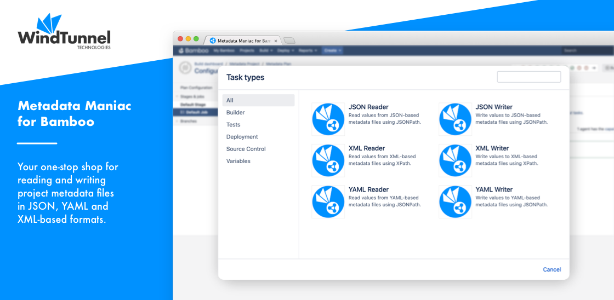

# Home

<kbd></kbd>

The [Metadata Maniac for Bamboo](https://marketplace.atlassian.com/apps/1223553/metadata-maniac-for-bamboo) plugin aims at being your one-stop shop for all metadata file reading and writing
needs. With current support for reading and writing:

- JSON field values using [JSONPath](https://goessner.net/articles/JsonPath), such as: [NPM package.json](https://www.npmjs.com),
[Dotnet appsettings.json](https://docs.microsoft.com/en-us/aspnet/core/fundamentals/configuration), [Angular Workspace](https://angular.io/guide/workspace-config)...
- XML field values using [XPath](https://www.w3.org/TR/xpath-3/), such as: [Maven pom.xml](https://maven.apache.org/index.html),
[Android Manifest](https://developer.android.com/guide/topics/manifest/manifest-intro), [.NET Nuspec](https://docs.microsoft.com/en-us/nuget/reference/nuspec),
[Apple Plist](https://developer.apple.com/library/archive/documentation/General/Reference/InfoPlistKeyReference/Articles/AboutInformationPropertyListFiles.html)...
- YAML field values using [JSONPath](https://goessner.net/articles/JsonPath), such as: [Kubernetes Specs](https://kubernetes.io/docs/concepts/overview/working-with-objects/kubernetes-objects/),
[Helm Charts](https://helm.sh/docs/topics/charts/), [Dart & Flutter pubspec](https://dart.dev/tools/pub/pubspec)...

Have a look at the [tutorial](tutorial.md) to quickly grasp the plugin concepts.

Support for additional formats is underway, as listed on the [roadmap](roadmap.md). Still missing something? Please [let us know](../common/support.md) and we'll make it work.

