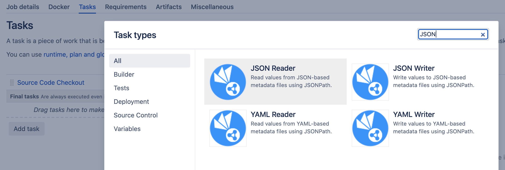
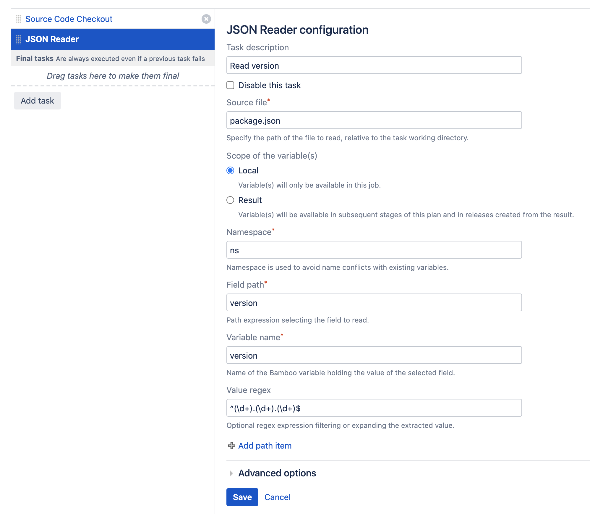
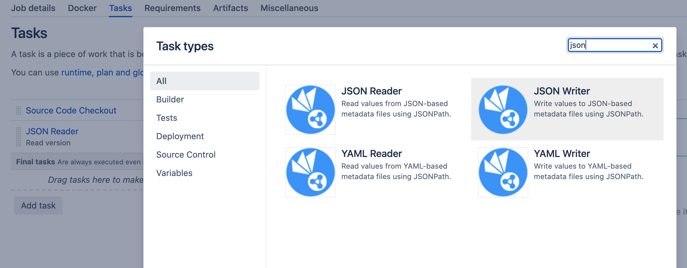
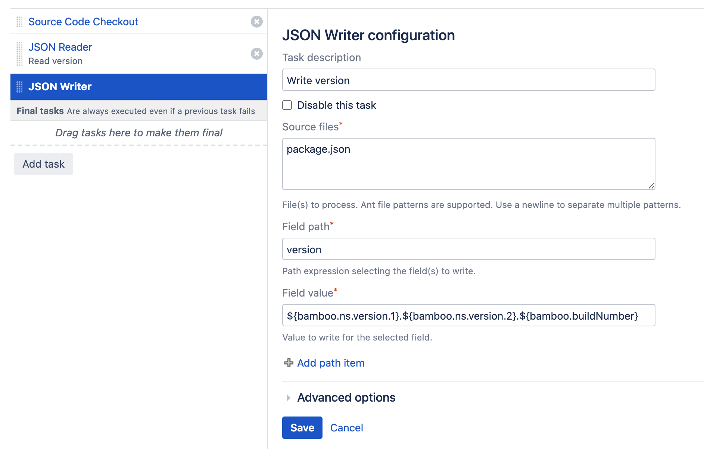

# Tutorial

- [Introduction](/tutorial?id=introduction)
- [Reading the Version Components](/tutorial?id=reading-the-version-components)
- [Writing the Updated Version](/tutorial?id=writing-the-updated-version)

## Introduction

In this tutorial, we assume a project using the [Node Package Manager](https://www.npmjs.com/) (NPM), the de facto package
manager for the JavaScript programming language. NPM is configured using a JSON-based metadata file, named *package.json*.
This file allows setting the current version of the project, as indicated by the second field in the listing below.

```
{
  "name": "intranet",
  "version": "1.2.0",
  "scripts": {
    "start": "ng serve",
    ...
  },
    ...
}
```

We would like to version the project package using a *[major].[minor].[build]* format, where the *major* and *minor* components
are set and controlled by the developers (checked into version control), and the *build* component is automatically updated
by the CI pipeline, i.e. Bamboo.

This common scenario is easily handled by the Metadata Maniac plugin, and is a two step process:

- First, we read the different components of the current version field into distinct Bamboo variables.
- Next, we assemble the desired version value and write it to the corresponding field in the file.

Both steps are detailed in the following sections.

## Reading the Version Components

After checking out the project source code, we add the *JSON Reader* task.

<kbd></kbd>

We configure the fields of this task as follows:

- ***Source file***: *package.json*, in the root of the project.
- ***Scope of the variable(s)***: leave the default *Local* value as-is, as the produced variables will only be needed in the current Job.
- ***Namespace***: isolates the produced variables from existing and predefined variables, simply using *ns* will do.
- ***Field path***: selects the desired field and accepts a [JSONPath](https://goessner.net/articles/JsonPath/) expression.
We simply use *version* here, as the field is in the root of the document. We could also use the more verbose *$.version* and *$['version']* expressions, which are equivalent. 
- ***Variable name***: the name of the resulting Bamboo variable, we choose *version* here for clarity.
- ***Value regex***: optional field accepting a [Regular Expression](https://en.wikipedia.org/wiki/Regular_expression),
which allows expanding the field value into separate variables matching the different *regex* groups. In this case, we would like to
match the format of the version field, which equals the expression *^(\d+).(\d+).(\d+)$*.

We do not require additional path items nor any of the advanced task options. The resulting configuration is shown in the screenshot below.

<kbd></kbd>

If we were to run the build at this point, the *JSON Reader* task would produce the following output:

```
Starting task 'Read version' of type...
Processing package.json
Setting variable 'ns.version.0' to value '1.2.0'
Setting variable 'ns.version.1' to value '1'
Setting variable 'ns.version.2' to value '2'
Setting variable 'ns.version.3' to value '0'
Finished task 'Read version' with result: Success
```

From which we derive that the provided *regex* has expanded the version field value into four distinct Bamboo variables.
We will use these variables next.

## Writing the Updated Version

We subsequently add the *JSON Writer* task.

<kbd></kbd>

And configure the fields of this task as follows:

- ***Source file***: we can write multiple files at the same time, but only need a single one here. We use *package.json* to select the file in the root of the project.
- ***Field path***: identical to the JSON Reader task, we specify *version* as the *JSONPath* expression to select the version field at the root of the document.
- ***Field value***: the value to write is a combination of the variables produced by the previous JSON Reader task, and the pre-defined *buildNumber* Bamboo variable.
The complete expression becomes: *${bamboo.ns.version.1}.${bamboo.ns.version.2}.${bamboo.buildNumber}*.

We do not require additional path items nor any of the advanced task options. The resulting configuration is shown in the screenshot below.

<kbd></kbd>

The build will produce the following output for this task:

```
Substituting variable: ${bamboo.ns.version.1} with 1	
Substituting variable: ${bamboo.ns.version.2} with 2
Substituting variable: ${bamboo.buildNumber} with 22
...
Starting task 'Write version' of type...
1 file(s) matched the provided patterns
Processing package.json
Writing value '1.2.22' to path 'version'
```

Which confirms the desired outcome: the version field in *package.json* has been updated, including the current build number.

