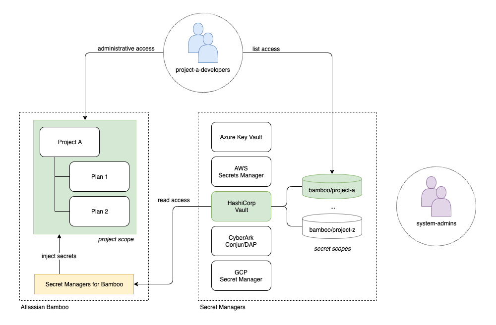

# The Big Picture

This page frames the *Secret Managers for Bamboo* plugin in a typical setup, involving two major stakeholders:
the system administrators, managing the company infrastructure and user permissions, 
and the software development team, involved in one or more projects.

Developers need sufficient freedom in creating and configuring the builds required for their project, as to
avoid inefficient back-and-forths between administration and development.
On the other hand, administration wants to avoid exposing the secrets required by the builds as much as
possible, including leaking secrets between different projects and teams.
In practice, developers should not need to know nor care about the actual values of the secrets they need.

In order to achieve these goals, the administrators configure the systems as illustrated in the schema below.

<kbd></kbd>

The administrators:

- Create a Bamboo group *project-a-developers*, and a project *Project A*.
The group receives 'create plan' permissions over the project, so (additional) plans can be created at will.
The group furthermore receives 'edit', 'build' and/or 'admin' permissions defined as inherited plan permissions,
allowing them to manage all plan related configurations (including the management of variables).

- Create a secret scope in the secret manager dedicated to the project. How the secret scope is defined depends on the
specific manager. For example: when using Azure the scope would probably be a distinct vault, while HashiCorp Vault
can easily be scoped based on paths. The depicted example uses HashiCorp Vault with a secret scope *bamboo/project-a*.

- Create two entities in the secret manager holding rights over the secret scope. A 'project-a-developers' group (mirroring the Bamboo group) allowed
to list the secret names, and an account dedicated to the *Secret Managers for Bamboo* plugin.
The latter only requires read access to the individual secrets.

- Configure a secret manager in the *Secret Managers for Bamboo* plugin, using the dedicated account. The manager is scoped
in Bamboo to 'Project A', excluding secret resolution from any other project.
The name of the specific manager is communicated to the developers, and should not change over the lifetime of the project.

Administrators and developers can subsequently work independently. As the project evolves,
the administrators will bring project specific infrastructure online, and while doing so add the secrets relevant to
development to the secret manager scope. Developers can consume the secrets by adding them as variables in their builds,
simply using the Bamboo secret manager name and the names of the secrets.

