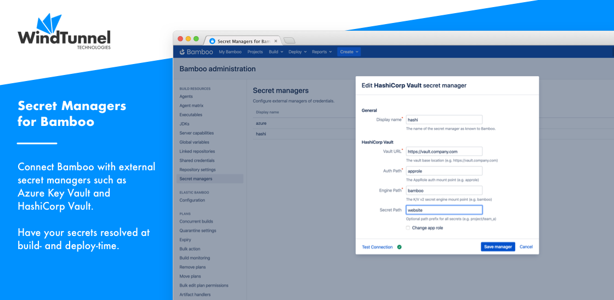

# Home

<kbd></kbd>

The [Secret Managers for Bamboo](https://marketplace.atlassian.com/1221965) plugin allows connecting your Bamboo installation
with any number of external secret managers.

The following managers are currently supported:

- [AWS Secrets Manager](https://aws.amazon.com/secrets-manager)
- [Azure Key Vault](https://azure.microsoft.com/en-us/services/key-vault)
- [CyberArk Conjur](https://www.conjur.org)
- [GCP Secret Manager](https://cloud.google.com/secret-manager)
- [HashiCorp Vault](https://www.vaultproject.io)
- [Oracle Cloud Vault](https://www.oracle.com/security/cloud-security/key-management)
- [Thycotic Secret Server](https://thycotic.com/products/secret-server)

Managing your secrets centrally and outside your build infrastructure allows for better security and governance, and will aid
with compliance.

Once a connection is defined with a secret manager, an intuitive and compact syntax can be used to reference external
secrets from Bamboo's global, plan or environment variables. As secrets are regular Bamboo variables, the same principle
applies to [Bamboo Specs](https://confluence.atlassian.com/bamboo/bamboo-specs-894743906.html) as well,
avoiding credential exposure in source control.

Furthermore, the plugin provides the following features vastly enhancing the security profile of your CI/CD pipelines:

- [Secret manager scoping](/topics/scoping.md): prevents leaking secrets between separate projects (and teams) within the same Bamboo installation.
- Secret rotation through [webhooks](/topics/webhooks.md): as secrets can be exposed in a number of ways, having them rotated immediately after usage is a best practice.

Please read [The Big Picture](big_picture.md) first for a 10,000 feet overview, after which one of our [Tutorials](/tutorials/) will help you get started.

If questions remain after working through this documentation, please reach out through our [Support](../common/support.md) page.