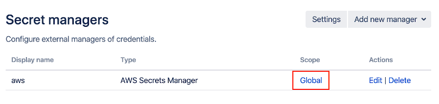
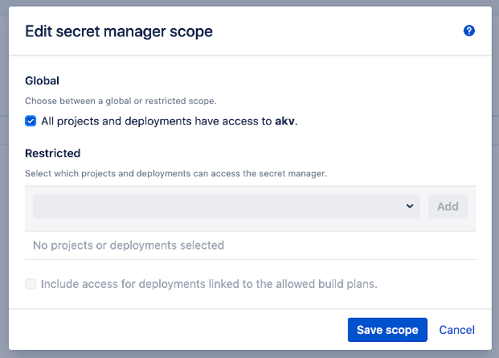
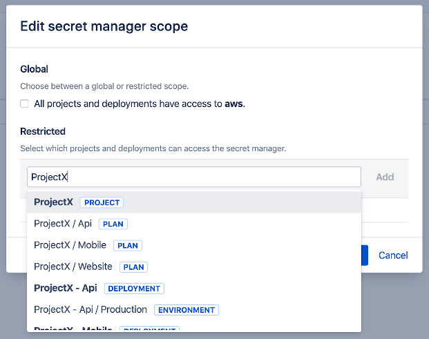
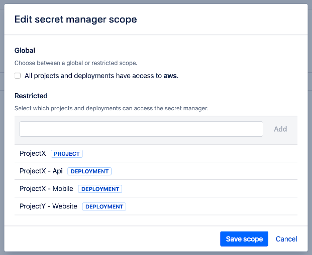
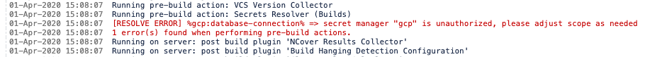

# Scoping

- [General](/topics/scoping?id=general)
- [Configuration](/topics/scoping?id=configuration)
- [Usage](/topics/scoping?id=usage)

## General

When creating a Secret Manager in Bamboo, its default scope is *global*.
This implies that the secrets held by this manager can be referred to by any Bamboo (Build) Plan or (Deployment) Environment.
As such, these secrets have the same permission scope as Bamboo [global variables](https://confluence.atlassian.com/bamboo/defining-global-variables-289277112.html).

However, from a security standpoint, it makes sense to only expose the secrets to the Plans and Environments that actually need them.
The *Secret Managers for Bamboo* plugin allows defining such a reduction in scope, for each individual manager.

## Configuration

After defining a Secret Manager, click the *Global* link in the *Scope* column.

<kbd></kbd>

The Secret Manager scope dialog appears:

<kbd></kbd>

In order to restrict the scope, unselect the checkbox below the *Global* section first. The elements found below the *Restricted* section will now be enabled.

Use the search box to filter the list of Projects and Deployments.

<kbd></kbd>

Select and add any combination of items to define the scope of the Secret Manager, given that:

- Selecting a Project implies granting access to all child Plans.
- Selecting a Deployment implies granting access to all child Environments.

As a consequence, once a Project has been added its child Plans will no longer be returned in the search results. The same principle applies to Deployments and child Environments.

<kbd></kbd>

In addition, the checkbox "Include access for deployments linked to the allowed build plans." can be set as shown above. When this option is set,
any deployment (and its child environments) which are linked to a whitelisted plan will automatically receive access to the Secret Manager as well.

Note that the same inheritance rules still apply. When only a build project is whitelisted and this flag is set, any future child plans as well as any deployments linked to them
will receive access without the need to update the scope.

To illustrate, consider the setup depicted below. 

```
Project (A)
  Plan (1) <- Deployment (X)
                Environment (Z)
                Envrionment (Y)
  Plan (2)
```

Plan (1) and Plan (2) are children of Project (A), and Plan (1) is configured as the source build plan for Deployment (X). Environment (Z) and Environment (Y)
are children of Deployment (X).

- If Project (A) is whitelisted, and the flag ***is not*** set, then only Plan (1) and Plan (2) receive access through inheritance.
- If Project (A) is whitelisted, and the flag ***is*** set, then Environment (Z) and Environment (Y) receive access in addition to Plan (1) and Plan (2).

> As the warning in the UI shows, be aware that this flag could lead to abuse when appropriate Bamboo permissions are not in place.
> When it is possible for a user to link a deployment to a plan, which is itself linked to a Secret Manager where this flag is set, secrets could inadvertently
> become exposed. Using the Bamboo project permissions, ensure that users and groups who can create deployments can only link with build plans to which they have
> the same access rights as the Secret Managers linked to them.

Save changes when done. The table will now display *Restricted* in the *Scope* column.

## Usage

Referencing a secret from a build or deployment not defined within the scope of the respective secret manager will result in the following error in the build log.

<kbd></kbd>


