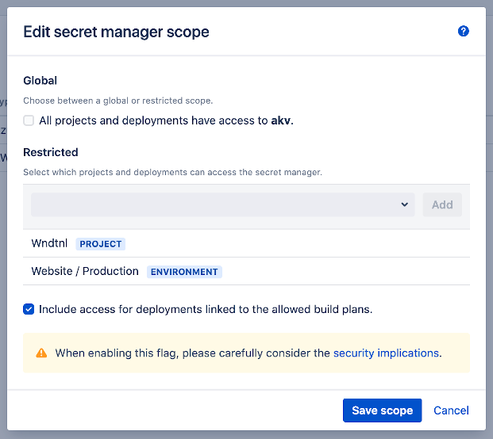

# Scoping

- [General](/topics/scoping?id=general)
- [Configuration](/topics/scoping?id=configuration)
- [Usage](/topics/scoping?id=usage)

## General

When creating a Secret Manager in Bamboo, its default scope is *global*.
This implies that the secrets held by this manager can be referred to by any Bamboo (Build) Plan or (Deployment) Environment.
As such, these secrets have the same permission scope as Bamboo [global variables](https://confluence.atlassian.com/bamboo/defining-global-variables-289277112.html).

However, from a security standpoint, it makes sense to only expose the secrets to the Plans and Environments that actually need them.
The *Secret Managers for Bamboo* plugin allows defining such a reduction in scope, for each individual manager.

## Configuration

After defining a Secret Manager, click the *Global* link in the *Scope* column.

<kbd></kbd>

The Secret Manager scope dialog appears:

<kbd></kbd>

In order to restrict the scope, unselect the checkmark below the *Global* section first. The search box below the *Restricted* section will now be enabled.

Use the search box to filter the list of Projects and Deployments.

<kbd></kbd>

Select and add any combination of items to define the scope of the Secret Manager, given that:

- Selecting a Project implies granting access to all child Plans.
- Selecting a Deployment implies granting access to all child Environments.

As a consequence, once a Project has been added its child Plans will no longer be returned in the search results. The same principle applies to Deployments and child Environments.

<kbd></kbd>

Save changes when done. The table will now display *Restricted* in the *Scope* column.

## Usage

Referencing a secret from a build or deployment not defined within the scope of the respective secret manager will result in the following error in the build log.

<kbd></kbd>
