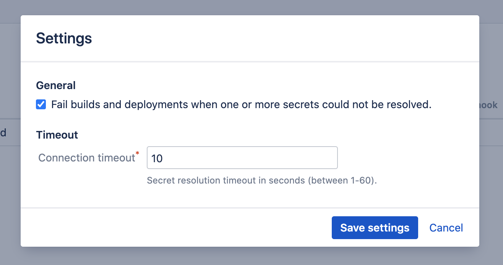
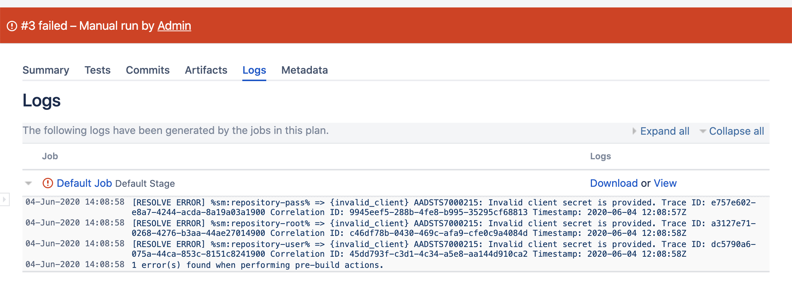

# Settings

To manage the plugin global settings, select *Settings* in the upper-right of the *Secret managers* administration page.
The global *Settings* dialog appears.

<kbd></kbd>

The following settings are available.

***Fail builds and deployments***

When this checkmark is selected, the plugin will fail each build and deployment for which at least one secret in its variable context could not be resolved.
The build logs will look as follows:

<kbd></kbd>

The default setting is ***not*** to fail the builds (checkmark deselected), because:

- it is assumed not all secrets in the context of a build or deployment are actually required, so a failed resolution of some secrets is not a de-facto reason
to fail the entire build.
- if a secret could not be resolved and that secret is actually used in the build or deployment, the step in which the secret is used will fail anyway.

Even when this checkmark is not selected, the logs will still contain any failed resolutions.

***Connection timeout***

This value allows adjusting the time the plugin waits for a response from the secret manager.
When secret resolution (intermittently) fails with errors related to 'connection timeouts', it is advised to increase this value.

A high value should however not be the norm, and might indicate an underlying network issue.