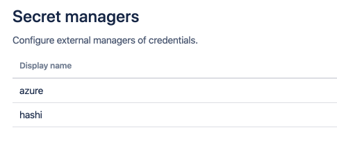

# Variable Syntax

- [General](/topics/syntax?id=general)
- [Part 1: secret-manager-name](/topics/syntax?id=part-1-secret-manager-name)
- [Part 2: secret-path](/topics/syntax?id=part-2-secret-path)
- [Part 3: secret-discriminator](/topics/syntax?id=part-3-secret-discriminator)

## General

Once a secret manager is defined on the administrative page of the plugin, secret values held by the manager can be
referred to from Bamboo Global, Project, Plan and Environment variable values using the following unified syntax:

```
%<secret-manager-name>:<secret-path>[:<secret-discriminator>]%
```

The variable value must start and end with the '%' marker character, and consists of a maximum of three distinct parts
separated by a colon ':' character. The different parts are discussed below.

## Part 1: secret-manager-name

This is the name of the secret manager and matches the *Display name* field in both the secret manager configuration dialogs,
as well as the overview table on the administrative page as shown below.

<kbd></kbd>

The secret manager name can be chosen at will, but can only contain alphanumeric characters and the dash '-' character.
The name must be unique and is preferably stable, as to avoid breaking the resolution of variables referring to the manager.

## Part 2: secret-path

The secret path is defined as follows:

```
[(<path-section>/)*]<secret-name>
```

At least the name of the secret is required. Some secret managers support structuring secrets hierarchically, which can be
expressed using the leading path sections. Each path section must be separated by a forward slash '/' character.

Both the path sections and the secret names can contain all characters except the colon ':', percent '%' and backslash '\\' characters.
However, individual secret managers might impose more restrictive naming rules.

## Part 3: secret-discriminator

This part is fully optional, and most use-cases will be covered without ever needing a discriminator.
When no discriminator is provided, the plugin falls back to sensible default behaviour. The accepted discriminator values are
specific to each secret manager. The table below lists the different options.

Secret manager | Discriminator values                                                                                                                                                                                                                                                                                                                                       | Default behaviour | Example
--- |------------------------------------------------------------------------------------------------------------------------------------------------------------------------------------------------------------------------------------------------------------------------------------------------------------------------------------------------------------| --- | ---
AWS Secrets Manager | When the discriminator is formatted as a GUID, the plugin assumes a [version id](https://docs.aws.amazon.com/secretsmanager/latest/userguide/terms-concepts.html#term_version). Otherwise, the discriminator is interpreted as a secret [stage label](https://docs.aws.amazon.com/secretsmanager/latest/userguide/terms-concepts.html#term_staging-label). | Fetch the secret with the *AWSCURRENT* stage label. | *106b6dfb-d4d9-4a79-bdfb-3188d73b5ac1* or *AWSPREVIOUS*
Azure Key Vault | The discriminator is the secret version. | Fetch the *latest* secret version. | *97329aedab024ee9ba707139008c164b*
CyberArk Conjur | The discriminator is the secret version. | Fetch the *latest* secret version. | *3*
GCP Secret Manager | The discriminator is the secret version. | Fetch the *latest* secret version. | *3*
HashiCorp Vault KVv1 | Not defined, any discriminator value is simply ignored. | *not applicable* | *not applicable*
HashiCorp Vault KVv2 | The discriminator is the secret version. | Fetch the *latest* secret version. | *3*
Oracle Cloud Vault | The discriminator can be the secret version (integer value) or the secret stage. The stage can be one of the following values: *CURRENT*, *PENDING*, *LATEST*, *PREVIOUS* or *DEPRECATED*. | Fetch the secret in the *CURRENT* stage. | *3* or *PREVIOUS*
Thycotic Secret Server | The discriminator is the secret field item *slug* (url-friendly field name as defined by the template). | Fetch the secret field item which is of type *password*. When multiple field items are of type *password*, an error is thrown. | *username*
Keeper Secrets Manager | The discriminator is either the field type, the field label or a derived name. Full details can be found below. | Fetch the secret field item which is of type *password*. | *login*

### Keeper Secrets Manager: Supported Discriminators

The table below lists the record types and corresponding discriminator values currently supported.

Record type | Discriminator values
--- | ---
Database | type, hostname, port, login, password
Secure Note | securenote, note, date
Login | login, password, url, onetimecode
Server | hostname, port, login, password
SSH Key | login, publickey, privatekey, password, passphrase, hostname, port