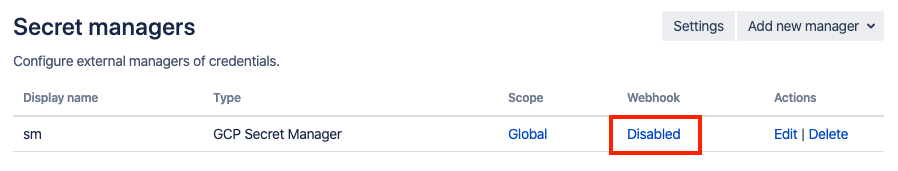
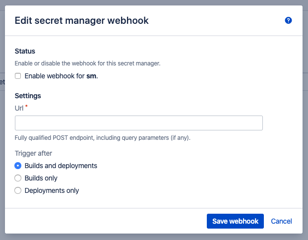
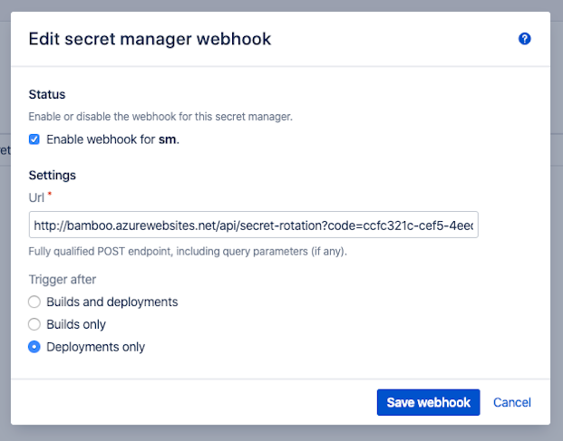

# Webhooks

- [General](/topics/webhooks?id=general)
- [Configuration](/topics/webhooks?id=configuration)
- [Usage](/topics/webhooks?id=usage)

## General

Having secrets centrally managed, stored external to Bamboo and properly [*scoped*](/topics/scoping.md) is already a major step forward in terms of risk management.
However, although the resolved secrets exist only in memory for the duration of the build or deployment, there are no guarantees that the secret values will not be revealed eventually.
Secrets could end up being written to a file on disk, to the log of an external system or embedded in a build artifact.
In fact, it should be assumed that secrets will be leaked sooner rather than later. 
As such, secrets should be considered *ephemeral* and not as static entities holding the same value for their entire lifetime. Systems depending on these secrets should be architected accordingly.

A classic mitigation strategy for the aforementioned risk is *secret rotation*. By frequently rotating a secret, its usefulness in the event of leakage is restricted in time.
The question then becomes: how often should the secret be rotated? The answer to this question depends on the environment in which the secret is used, but to minimise risk should be done as close as possible to the event in which the secret could have been leaked.
In the context of a CI/CD pipeline, this means at the end of a build or deployment in which the secret was used.

The *Secret Managers for Bamboo* plugin supports this scenario through the definition of a webhook for each secret manager.
This webhook can be configured to trigger at the end of a build and/or deployment in which secrets held by the respective secret manager were involved.
An external service (such as a cloud function) can then be notified and in turn rotate secrets as needed.

## Configuration

After defining a Secret Manager, click the *Disabled* link in the *Webhook* column.

<kbd></kbd>

The Secret Manager webhook dialog appears:

<kbd></kbd>

Enable the webhook by clicking the checkbox in the *Status* section, and complete the remaining *Settings*:

- *Url*: the fully qualified URL of the webhook, including any query parameters as needed. An HTTP POST request will arrive on this endpoint, with a JSON payload as defined below.
- *Trigger after*: allows restricting the context in which the webhook is triggered. For example: when a deployment is automatically performed as a result of a successful build, it is probably counter-productive to trigger the webhook at the end of the build. In that case, adjust to *Deployments only*.
It should be noted however that such logic can be added to the service responsible for secret rotation as well, based on the provided webhook payload.

<kbd></kbd>

Save changes when done. The table will now display *Enabled* in the *Webhook* column.

## Usage

In order to test the webhook functionality, we advice using a service such as https://requestbin.com/r
which allows receiving and inspecting the webhook payload without setting up a custom service first.

When a webhook is triggered, it carries a JSON body indicating:

- For which source (i.e. secret manager) the webhook was triggered.
- For which build (i.e. combination project/plan) or deployment (i.e. combination deployment/environment) the webhook was triggered.
- Which secrets of the secret manager were part of build/deployment context.

An example build payload:

```
{
    "timestamp": "2020-04-08T15:56:53.470Z",
    "source": {
        "id": "292e0314-b0ec-4a19-9c1c-b7066fcba262",
        "name": "sm",
        "type": "gsm",
        "typeName": "GCP Secret Manager"
    },
    "context": {
        "type": "build",
        "result": "successful",
        "parentName": "ProjectX",
        "parentKey": "PROJECTX",
        "childName": "ProjectX - Api",
        "childKey": "PROJECTX-API",
        "version": "1",
        "branchName": "master"
    },
    "secrets": [
        "repository-root",
        "repository-pass",
        "repository-user"
    ]
}
```

An example deployment payload:

```
{
    "timestamp": "2020-04-08T16:03:23.490Z",
    "source": {
        "id": "292e0314-b0ec-4a19-9c1c-b7066fcba262",
        "name": "sm",
        "type": "gsm",
        "typeName": "GCP Secret Manager"
    },
    "context": {
        "type": "deployment",
        "result": "successful",
        "parentName": "ProjectX - Api",
        "parentKey": "3407874",
        "childName": "Production",
        "childKey": "3473410",
        "version": "release-1",
        "branchName": "master"
    },
    "secrets": [
        "repository-root",
        "repository-pass",
        "repository-user"
    ]
}
```

This payload allows a service responsible for secret rotation to decide when to rotate, and which secrets should preferably be rotated.