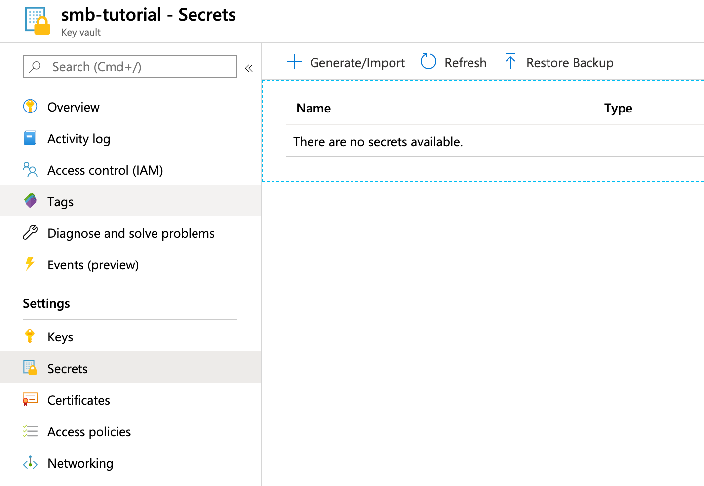

# Azure Key Vault

- [Introduction](/tutorials/akv?id=introduction)
- [Azure Setup](/tutorials/akv?id=azure-setup)
    - [Create a Key Vault](/tutorials/akv?id=create-a-key-vault)
    - [Define a Secret](/tutorials/akv?id=define-a-secret)
    - [Service Principal](/tutorials/akv?id=service-principal)
- [Bamboo Setup](/tutorials/akv?id=bamboo-setup)
    - [Add Key Vault Manager](/tutorials/akv?id=add-key-vault-manager)
    - [Define Secret Variable](/tutorials/akv?id=define-secret-variable)
- [Testing](/tutorials/akv?id=testing)

## Introduction

This tutorial demonstrates how to get started with [Secret Managers for Bamboo](https://marketplace.atlassian.com/1221965) and [Azure Key Vault](https://azure.microsoft.com/en-us/services/key-vault/).

We assume a *Microsoft Azure* account at https://portal.azure.com. If you have no such account yet, please head over to https://azure.microsoft.com/en-us/free and create one first.

> Depending on our Azure subscription and actual usage, following along with this tutorial could incur some (minimal) costs. Please refer to the Azure Key Vault pricing page at https://azure.microsoft.com/en-us/pricing/details/key-vault/, and the Azure Storage Account pricing page at https://azure.microsoft.com/en-us/pricing/details/storage/files/ for details.

## Azure Setup

### Create a Key Vault

Once signed in into the portal, select *Create a resource* from the upper-left and search for *Key Vault*.

<kbd></kbd>

Select the *Key Vault* suggestion and click the *Create* button on the resource overview page.

<kbd></kbd>

Complete the *Basics* page of the Key Vault creation wizard. Take note of the *Key vault name* ('smb-tutorial' in the screenshot below). It uniquely identifies your Vault within Azure and will be used later on when configuring Bamboo. It must be a 3 to 24 character string and can only contain 0-9, a-z, A-Z, and - (dash).

<kbd></kbd>

Click *Review + create*, and subsequently *Create*. The tabs *Access policy*, *Networking* and *Tags* will be left as-is for this tutorial.

### Define a Secret

Once your Key Vault is ready, click through and open its management page.

<kbd></kbd>

We will create a first secret for demonstration purposes. Click on *Secrets* in the menu on the left, and subsequently on *Generate/Import* on top.

<kbd></kbd>

The only required fields are the *Name* and *Value*, others can be left as-is. The name must be a 1-127 character string, and can only contain 0-9, a-z, A-Z, and - (dash). Take note of the chosen name ('database-connection' in the screenshot above), as it will be used to resolve the secret from Bamboo.

Click *Create* when done.

### Service Principal

We will now define a *Service Principal* (SP), which is the system account under which Bamboo will authenticate with Azure, and authorize against the Key Vault. Additional information can be found at https://docs.microsoft.com/en-us/azure/key-vault/key-vault-group-permissions-for-apps.

> There are multiple ways to properly set up the SP, but we choose the *Azure Cloud Shell* below as it allows for the most dense explanation.

#### Creation

Open the *Azure Cloud Shell* from the top right portal menu.

<kbd></kbd>

> In what follows, we assume a *Bash* shell. The *Azure Cloud Shell* requires a storage account, which can be created or selected as applicable. Do not forget to delete the storage account afterwards if it is no longer needed.

Create the SP by issuing the command below in the shell:

```
az ad sp create-for-rbac -n "http://smb-tutorial"
```

Change the name in the command (indicated with the -n flag) as desired, given that:

- The name must be a url, so prefix it with 'http://'. This is a fictional url, it must not resolve to anything existing.
- The SP name has no relation to the Key Vault name, it can be chosen independently and it is possible to associate multiple distinct SP's with the same Vault. For consistency, we use the same name in this example.

The output of this command will look as follows:

```
{
  "appId": "db515e94-e267-4a00-8951-b6ccb2b544ad",
  "displayName": "smb-tutorial",
  "name": "http://smb-tutorial",
  "password": "d3238241-3f6e-4313-b3ce-c188071c0b0d",
  "tenant": "96b51e58-bd51-47df-8772-446b477e0e8a"
}
```

Take note of the following values, as they will be used when configuring Bamboo:

- *tenant*: identifies the Azure Active Directory (AAD) where the SP is stored.
- *appId* (or client id): uniquely identifies the SP within the AAD.
- *password* (or client secret): the password of the SP, used when requesting an access token from the AAD.

#### Grant Rights

To finalize, we will grant the SP the rights to 'get' secrets from the Key Vault.

> Azure Key Vault allows to assign multiple permissions over secrets, such as *get*, *list*, *set*, *delete*... It is a best practice to restrict the rights as much as possible for each user, and for our use-case *get* rights are all that is needed.

Issue the command below in the shell:

```
az keyvault set-policy -n smb-tutorial --spn db515e94-e267-4a00-8951-b6ccb2b544ad --secret-permissions get
```

Here the *-n* flag refers to the name of the Vault and the *--spn* flag to the *appId* of the SP. Please adjust as needed.

Once the command completes successfully, the result can be verified in the Key Vault management page below *Access policies*.

<kbd></kbd>

Azure setup is hereby complete.

## Bamboo Setup

It is assumed the *Secret Managers for Bamboo* plugin has been successfully installed in your Bamboo
server installation. The plugin will add an administrative menu item *Secret managers* at the bottom of
the *Build Resources* section.

<kbd></kbd>

### Add Key Vault Manager

On the *Secret managers* page, select *Azure Key Vault* from the *Add new manager* drop-down in the upper-right.
The *Add new Azure Key Vault* dialog appears.

<kbd></kbd>

Complete the fields as indicated:

- *Display name*: this name is Bamboo-specific. It will appear on the *Secret managers* overview page, and is used to refer to the secrets held by this secret manager from Bamboo variable values. It can only contain 0-9, a-z, A-Z, and - (dash) characters.
- *Tenant Id*: of the Service Principal (SP), as previously defined.
- *Vault name*: as defined when creating the Key Vault.
- *Client Id*: the SP app id, as previously defined.
- *Client Secret*: the SP password, as previously defined.

Before the manager is saved, the connection can be tested. When the connection fails, hover over the crossmark icon to reveal the cause.

<kbd></kbd>

> It is important to understand that the 'Test Connection' functionality is not bulletproof, as none of the secret names are known to
> Bamboo at this point. Only some basic checks are performed on the provided data. The actual secret resolution only happens at
> build time, which can still fail for a number of reasons.

Once the manager is saved, it is shown in the overview from where it can be edited and deleted.

### Define Secret Variable

We can now refer to the Key Vault secrets from Bamboo global, project, plan or environment variables.
As an example, we define our secret as a plan variable in the screenshot below.

<kbd></kbd>

The value of the *DatabaseConnection* variable refers to the Azure Key Vault secret using the special syntax:

```
%<secret-manager-name>:<secret-path>%
```

Which in our case becomes:

```
%azure:database-connection%
```

For Azure Key Vault, the *secret-path* always equals the secret name as define in Azure, as Key Vault does not allow secret hierarchies.

See the [variable syntax](/topics/syntax.md) page for additional details.

## Testing

As the secret is defined as a regular Bamboo variable, all existing use-cases regarding Bamboo variables apply.
For additional information, please refer to [the following Bamboo article](https://confluence.atlassian.com/bamboo/bamboo-variables-289277087.html).

To test our configuration, we define a simple script task printing our variable to the logs, as depicted in the screenshot below.

<kbd></kbd>

When running this plan, the logs will mention the *Secrets Resolver* pre-build action, 
which ad hoc resolves our secrets through the defined secret managers. The actual secret value only exists in memory for the duration of the build or deployment.

<kbd></kbd>

The plugin will also ensure that the secrets are never revealed in the logs.
