# AWS Secrets Manager

- [Introduction](/tutorials/asm?id=introduction)
- [AWS Setup: User Interface (Option 1)](/tutorials/asm?id=aws-setup-user-interface-option-1)
    - [Define a Secret](/tutorials/asm?id=define-a-secret)
    - [Create a User](/tutorials/asm?id=create-a-user)
- [AWS Setup: Command Line (Option 2)](/tutorials/asm?id=aws-setup-command-line-option-2)
    - [Define a Secret](/tutorials/asm?id=define-a-secret-1)
    - [Create a User](/tutorials/asm?id=create-a-user-1)
- [Bamboo Setup](/tutorials/asm?id=bamboo-setup)
    - [Add AWS Secrets Manager](/tutorials/asm?id=add-aws-secrets-manager)
    - [Define Secret Variable](/tutorials/asm?id=define-secret-variable)
- [Testing](/tutorials/asm?id=testing)

## Introduction

This tutorial demonstrates how to get started with [Secret Managers for Bamboo](https://marketplace.atlassian.com/1221965) and the [AWS Secrets Manager](https://aws.amazon.com/secrets-manager/).

We assume an *AWS* account at https://console.aws.amazon.com. If you have no such account yet, please head over to https://portal.aws.amazon.com/billing/signup and create one first.

> Depending on our AWS trail period and actual usage, following along with this tutorial could incur some (minimal) costs. Please refer to the AWS Secrets Manager pricing page at https://aws.amazon.com/secrets-manager/pricing for details.

AWS setup can be performed through the [user interface](/tutorials/asm?id=aws-setup-user-interface-option-1)
or from the [command line](/tutorials/asm?id=aws-setup-command-line-option-2). Working through the user interface is detailed first, after which it is briefly shown how to achieve the same results from the command line.
Please read both sections for a full understanding.

## AWS Setup: User Interface (Option 1)

### Define a Secret

Once signed in into the console, select *Services* from the top menu, search for and open the *Secrets Manager* service.

<kbd>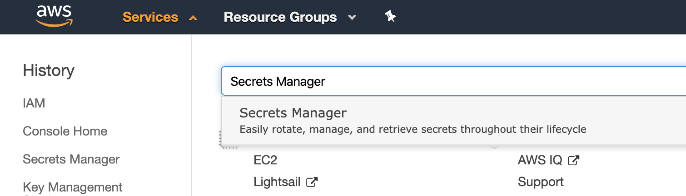</kbd>

Select the *Store a new secret* button in the *Get Started* box on the right. The secret creation wizard is shown.

<kbd>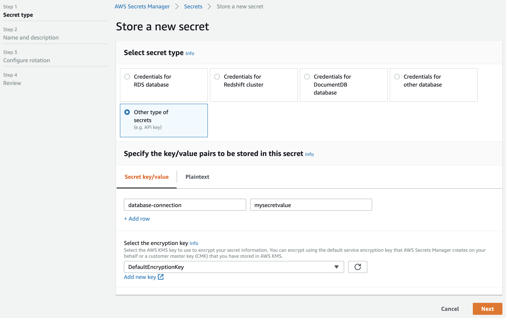</kbd>

Complete step 1 as shown above, and click *Next*.

<kbd>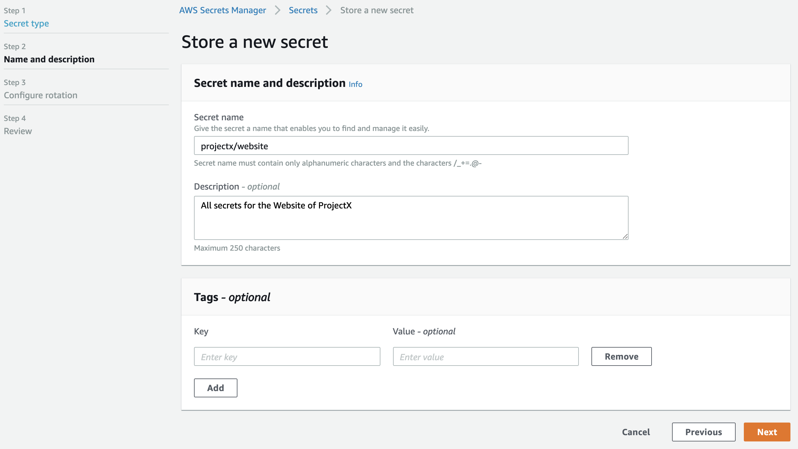</kbd>

For the secret name, we add a path (i.e. projectx/website) as a form of scoping. This can be used to our advantage when configuring Bamboo later on.

> *AWS Secrets Manager* accepts alphanumeric characters, as well as /_+=@-, as indicated in the screenshot. However, in order to cater for the restrictions in other secret managers,
> the *Secret Managers for Bamboo* plugin only accepts alphanumeric characters, dashes, underscores and the forward-slash (path character).
> As such, *projectx/website*, *Project_X/WEBSITE* and *Project-001/Website* are all valid. Please name your secrets in *AWS Secrets Manager* accordingly.

Click *Next* to proceed to step 3.

<kbd>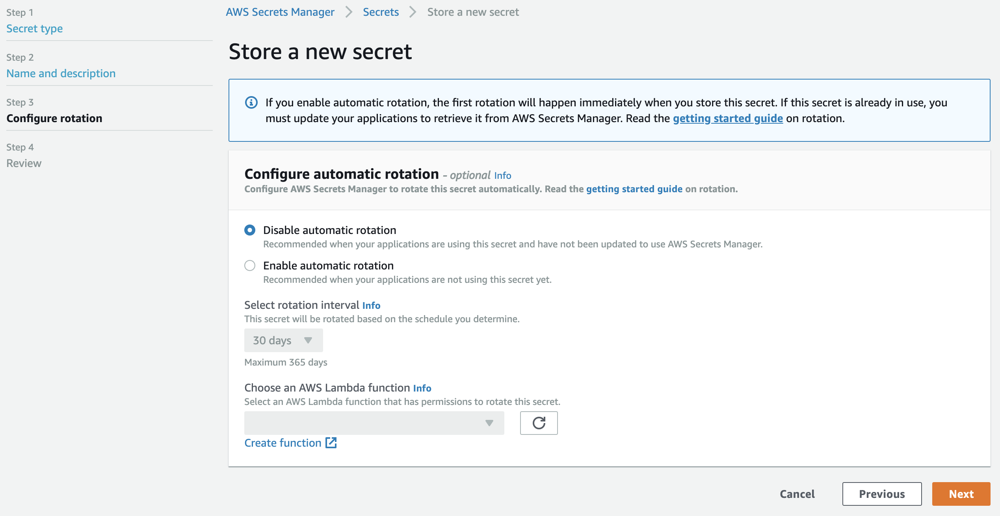</kbd>

Leave this form as-is: automatic rotation is outside the scope of this tutorial. Click *Next* to proceed to the final step, and confirm by clicking *Store*.

Select the created secret and take note of the *Secret ARN*, as indicated below. It will be needed in the next section.

<kbd>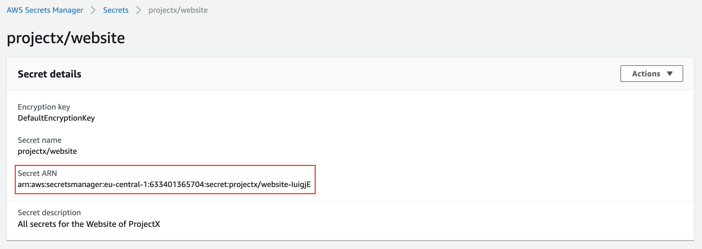</kbd>

### Create a User

We will now create a dedicated *IAM* user with programmatic access scoped to the previously defined secret.

Select *Services* from the top menu, search for and open the *IAM* service.

<kbd>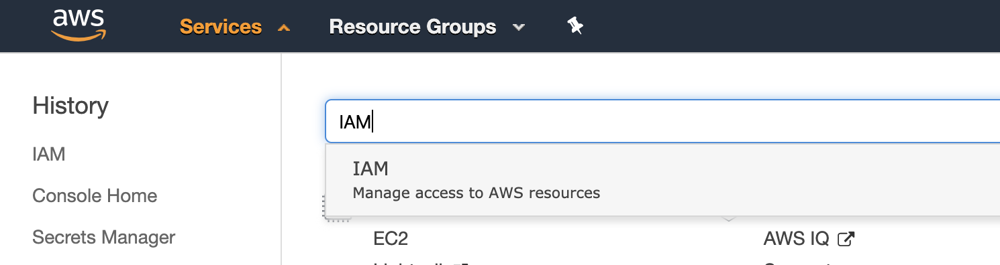</kbd>

In the menu on the left, select *Users* and click the *Add user* button. The user creation wizard is shown.

<kbd>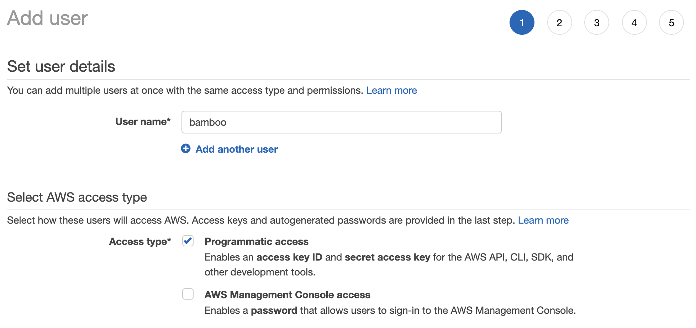</kbd>

Ensure this user has only *Programmatic access*.

All other steps of the wizard can be left as-is. We do not assign permissions nor tags here, so the review step should look as indicated below.

<kbd>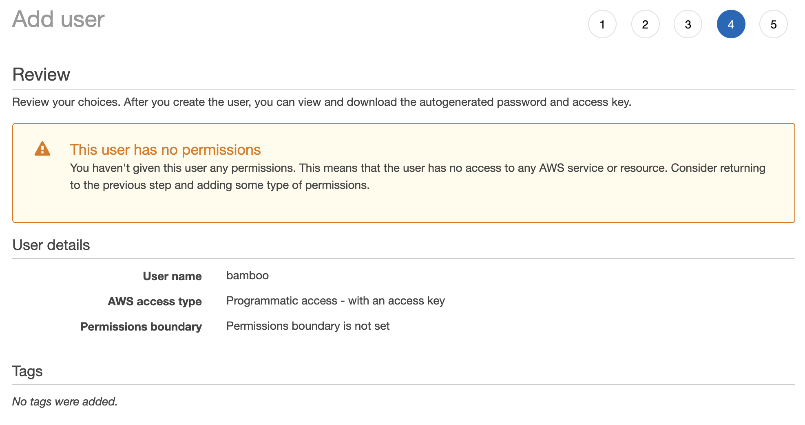</kbd>

On the final page, once the user is created, take note of the *Access Key ID* and *Secret access key*. They will be needed when configuring Bamboo later on.

<kbd>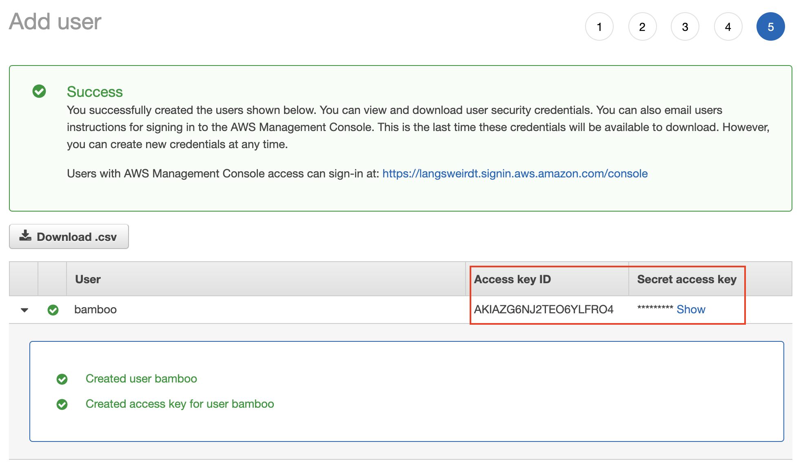</kbd>

We will now proceed with adding permissions to this user in the form of an *inline policy*.
From the *Users page* on the *IAM* service, select the created user and click *Add inline policy*.

<kbd>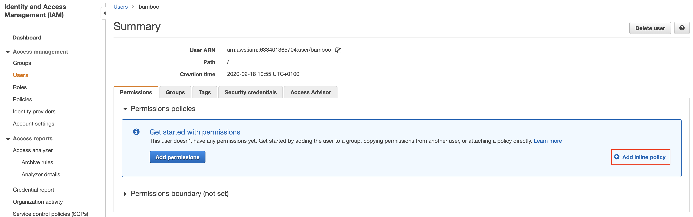</kbd>

The policy can be added using the *Visual editor* or as JSON. The final JSON value should look as follows:

```
{
    "Version": "2012-10-17",
    "Statement": [
        {
            "Sid": "VisualEditor0",
            "Effect": "Allow",
            "Action": "secretsmanager:GetSecretValue",
            "Resource": "arn:aws:secretsmanager:eu-central-1:633401365704:secret:projectx/*"
        }
    ]
}
```

This policy defines read access to all secrets below the *projectx* path, including our previously defined *projectx/website/database-connection*.
The *Resource* value is based on the *Secret ARN* value as specified in the previous section, please adjust as needed.

Review, name and save this policy.

<kbd>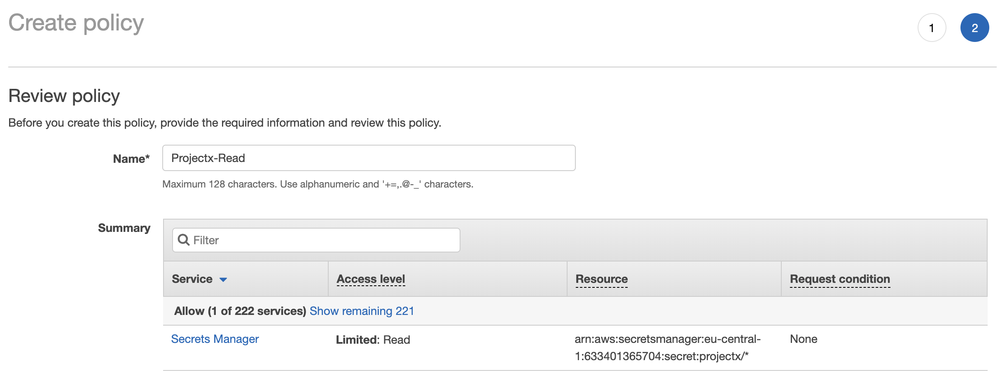</kbd>

*AWS* setup is hereby complete.

## AWS Setup: Command Line (Option 2)

Install and configure the AWS command line tool following the instructions for your platform available at
https://docs.aws.amazon.com/cli/latest/userguide/install-cliv2.html and https://docs.aws.amazon.com/cli/latest/userguide/cli-chap-configure.html respectively.

> Usage of AWS CLI version 2 is assumed in what follows.

### Define a Secret

A secret can easily be defined using the secretsmanager *create-secret* subcommand, as shown below.

```
$ aws2 secretsmanager create-secret --name projectx/website --secret-string '{"database-connection":"mysecretvalue"}'
{
    "ARN": "arn:aws:secretsmanager:eu-central-1:644510365408:secret:projectx/website-BPCUbz",
    "Name": "projectx/website",
    "VersionId": "7def8d76-2277-4207-b883-f53075e77d60"
}
```

Take note of the ARN value of the created secret, as provided by the command output.

### Create a User

We first use the iam *create-user* subcommand to define our *bamboo* user:

```
$ aws2 iam create-user --user-name bamboo
{
    "User": {
        "Path": "/",
        "UserName": "bamboo",
        "UserId": "AIBAZG6NJ8TE9AEUIXFXU",
        "Arn": "arn:aws:iam::633601865901:user/bamboo",
        "CreateDate": "2020-03-16T16:09:30+00:00"
    }
}
```

Next, we enable programmatic access for this user by means of the *create-access-key* subcommand:

```
$ aws2 iam create-access-key --user-name bamboo
{
    "AccessKey": {
        "UserName": "bamboo",
        "AccessKeyId": "AKIBZG8NJ2TEA5TPND7F",
        "Status": "Active",
        "SecretAccessKey": "BKS6jBZH9F2prRSFr7UR0yz9lAMqP4oYdXeRzU1S",
        "CreateDate": "2020-03-16T16:13:38+00:00"
    }
}
```

This command outputs the required *AccessKeyId* and *SecretAccessKey* values.

Finally, we define an inline policy granting the *bamboo* user read access to the previously defined secret.

For convenience, we first store the policy definition in a file named *projectx-read.json*:

```
$ cat projectx-read.json
{
    "Version": "2012-10-17",
    "Statement": [
        {
            "Sid": "CommandLine",
            "Effect": "Allow",
            "Action": "secretsmanager:GetSecretValue",
            "Resource": "arn:aws:secretsmanager:eu-central-1:644510365408:secret:projectx/*"
        }
    ]
}
```

And apply the policy as follows:

```
$ aws2 iam put-user-policy --user-name bamboo --policy-name Projectx-Read --policy-document file://projectx-read.json
```

*AWS* setup is hereby complete.

## Bamboo Setup

It is assumed the *Secret Managers for Bamboo* plugin has been successfully installed in your Bamboo
server installation. The plugin will add an administrative menu item *Secret managers* at the bottom of
the *Build Resources* section.

<kbd></kbd>

### Add AWS Secrets Manager

On the *Secret managers* page, select *AWS Secrets Manager* from the *Add new manager* drop-down in the upper-right.
The *Add new AWS Secrets Manager* dialog appears.

<kbd>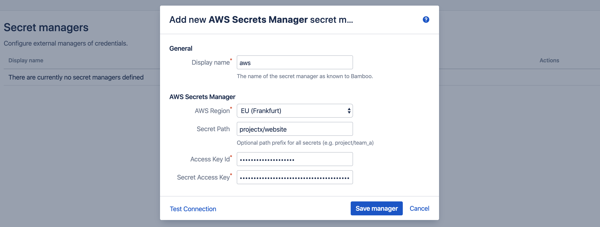</kbd>

Complete the fields as indicated:

- *Display name*: this name is Bamboo-specific. It will appear on the *Secret managers* overview page, and is used to refer to the secrets held by this secret manager from Bamboo variable values. It can only contain 0-9, a-z, A-Z, and - (dash) characters.
- *AWS Region*: this is the region in which the AWS Secrets Manager is hosted by AWS. It can be derived from the *Secret ARN* (e.g. eu-central-1 equals Frankfurt), but it is more easily retrieved from the top-right menu in the AWS console.
- *Secret Path*: this field is optional and can be left blank.
When defined, its value is prefixed to the path of each secret referenced by this secret manager.
In our example, we defined the secret name as *projectx/website* when creating the secret in AWS, which must be combined with the actual secret keys (e.g. *database-connection*).
If we use *projectx/website* as value for this field, we can refer to the secrets in Bamboo as just *database-connection*. If this field is left blank, we will need the full path everywhere this secret is used (i.e. *projectx/website/database-connection*). It is also possible to use the vaule *projectx*, and refer to the secrets as *website/database-connection*.
- *Credentials*: select *Explicit*, which allows adding the *Access Key Id* and *Secret Access Key* directly from the Bamboo UI. As an alternative, the *Implicit* setting fetches the credentials automatically
from environment variables (AWS_ACCESS_KEY_ID and AWS_SECRET_ACCESS_KEY), java system properties (aws.accessKeyId and aws.secretKey), AWS web identity token, the default AWS credential profiles file, AWS ECS container credentials or AWS instance profile credentials (searched for in the provided order).  
- *Access Key Id*: as generated when creating the IAM user.
- *Secret Access Key*: as generated when creating the IAM user.

Before the manager is saved, the connection can be tested. When the connection fails, hover over the crossmark icon to reveal the cause.

<kbd>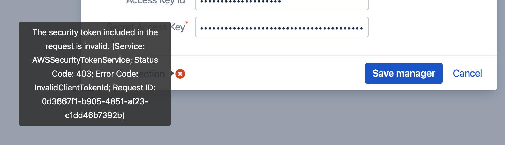</kbd>

> It is important to understand that the 'Test Connection' functionality is not bulletproof, as none of the secret names are known to
> Bamboo at this point. Only some basic checks are performed on the provided data. The actual secret resolution only happens at
> build time, which can still fail for a number of reasons.

Once the manager is saved, it is shown in the overview from where it can be edited and deleted.

### Define Secret Variable

We can now refer to the *AWS Secrets Manager* secrets from Bamboo global, project, plan or environment variables.
As an example, we define our secret as a plan variable in the screenshot below.

<kbd>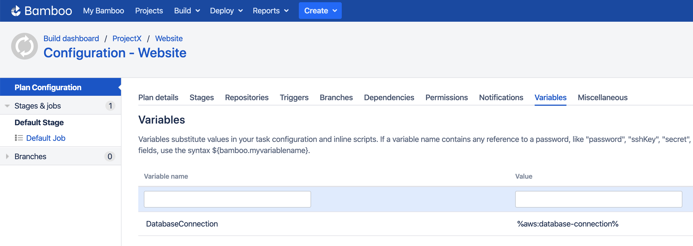</kbd>

The value of the *DatabaseConnection* variable refers to the *ASM Secrets Manager* secret using the special syntax:

```
%<secret-manager-name>:<secret-path>%
```

Which in our case becomes:

```
%aws:database-connection%
```

As explained above, if the *Secret Path* field would have been left empty in the *Add new AWS Secrets Manager* dialog, the
secret must be referenced as follows:

```
%aws:projectx/website/database-connection%
```

See the [variable syntax](/topics/syntax.md) page for additional details.

## Testing

As the secret is defined as a regular Bamboo variable, all existing use-cases regarding Bamboo variables apply.
For additional information, please refer to [the following Bamboo article](https://confluence.atlassian.com/bamboo/bamboo-variables-289277087.html).

To test our configuration, we define a simple script task printing our variable to the logs, as depicted in the screenshot below.

<kbd></kbd>

When running this plan, the logs will mention the *Secrets Resolver* pre-build action, 
which ad hoc resolves our secrets through the defined secret managers. The actual secret value only exists in memory for the duration of the build or deployment.

<kbd></kbd>

The plugin will also ensure that the secrets are never revealed in the logs.
