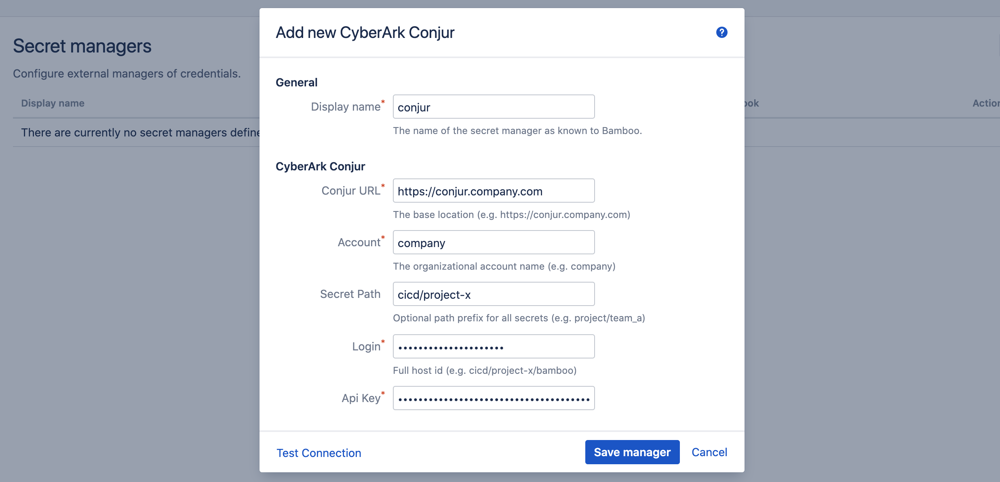
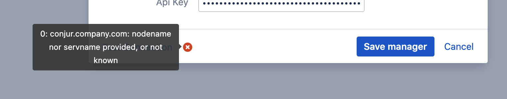
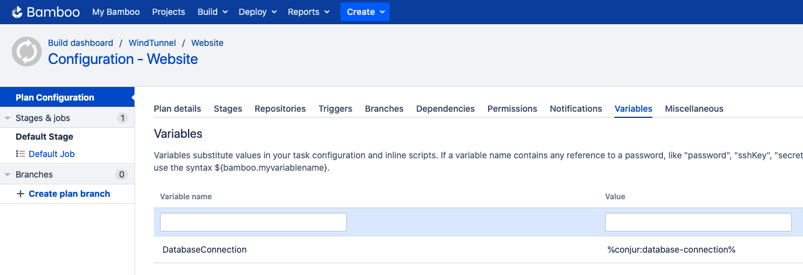

# CyberArk Conjur

- [Introduction](/tutorials/cac?id=introduction)
- [Conjur Setup](/tutorials/cac?id=conjur-setup)
    - [Load Policy](/tutorials/cac?id=load-policy)
    - [Set Variable Value](/tutorials/cac?id=set-variable-value)
- [Bamboo Setup](/tutorials/cac?id=bamboo-setup)
    - [Add CyberArk Conjur Manager](/tutorials/cac?id=add-cyberark-conjur-manager)
    - [Define Secret Variable](/tutorials/cac?id=define-secret-variable)
- [Testing](/tutorials/cac?id=testing)

## Introduction

This tutorial demonstrates how to get started with [Secret Managers for Bamboo](https://marketplace.atlassian.com/1221965) and
[CyberArk Conjur](https://www.conjur.org/), henceforth abbreviated as just *Conjur*.

> It should be noted that the CyberArk product portfolio includes the [Dynamic Access Provider (DAP)](https://docs.cyberark.com/Product-Doc/OnlineHelp/AAM-DAP/Latest/en),
> as part of the [Application Access Manager](https://www.cyberark.com/products/privileged-account-security-solution/application-access-manager/) offering. DAP is CyberArk's
> enterprise version of the open-source Conjur project. As DAP and Conjur are API compatible in terms of variable access, both are equally supported by this plugin.
> All references to Conjur must as such be understood as a reference to DAP as well.

We assume a running *Conjur* server installation with administrative access, accessible from your Bamboo server installation.
If this is not the case, kindly consult the [Conjur documentation](https://docs.conjur.org/Latest/en/Content/OSS/Installation/Install_methods.htm) first.

> For this tutorial, we assume the Conjur server resides at https://conjur.company.com, and an account named *company* has been created.
> Please adjust the provided instructions as needed.

This tutorial uses the [CLI](https://github.com/cyberark/conjur-cli) to access and configure *Conjur*.

## Conjur Setup

### Load Policy

We define a minimal root policy, specifying a *cicd* branch owned by the *cicd-admins* group:

```
# root_policy.yml

# groups
- !group cicd-admins

# grants
- !grant
  role: !group cicd-admins
  member: !user admin

# policy
- !policy
  id: cicd
  owner: !group cicd-admins
```

Load the policy using the CLI as follows:

```
$ conjur policy load root root_policy.yml
```

Next, we define a child policy of *cicd* for a fictitious *project-x*, holding a variable *database-connection* and accessible by host *bamboo*:

```
# project-x_policy.yml

- !policy
  id: project-x
  body:
    - &variables
      - !variable database-connection

    - !host bamboo

    - !layer project-x

    - !grant
      role: !layer project-x
      member: !host bamboo

    - !permit
      role: !layer project-x
      privileges: [ read, execute ]
      resources: *variables
```

Load this policy as a child of *cicd* as follows:

```
$ conjur policy load cicd project-x_policy.yml
```

Because a *host* resource is created when loading this policy, its generated *api key* will be returned:

```
{
  "created_roles": {
    "company:host:cicd/project-x/bamboo": {
      "id": "company:host:cicd/project-x/bamboo",
      "api_key": "rhhyxv3fdf3gq109ax8617cjbga29kz6wy1186mbv9px6pg1yssdgt"
    }
  },
  "version": 1
}
``` 

Take note of this value, as it will be used when configuring Bamboo later on. The fully-qualified *id* of the host will be required as well,
being *cicd/project-x/bamboo* in this example.

### Set Variable Value

The variable *database-connection* has been defined, but a value still needs to be set. Execute the following CLI command:

```
$ conjur variable values add cicd/project-x/database-connection supersecret
```

*Conjur* setup is hereby complete.

## Bamboo Setup

It is assumed the *Secret Managers for Bamboo* plugin has been successfully installed in your Bamboo
server installation. The plugin will add an administrative menu item *Secret managers* at the bottom of
the *Build Resources* section.

<kbd></kbd>

### Add CyberArk Conjur Manager

On the *Secret managers* page, select *CyberArk Conjur* from the *Add new manager* drop-down in the upper-right.
The *Add new CyberArk Conjur* dialog appears.

<kbd></kbd>

Complete the fields as indicated:

- *Display name*: this name is Bamboo-specific. It will appear on the *Secret managers* overview page, and is used to refer to the secrets held by this secret manager from Bamboo variable values. It can only contain 0-9, a-z, A-Z, and - (dash) characters.
- *Conjur URL*: the base URL of your *Conjur* server installation.
- *Account*: the account (i.e. tenant) within the installation.
- *Secret Path*: this field is optional and can be left blank.
When defined, its value is prefixed to the path of each secret referenced by this secret manager.
In our example, we defined the secret *database-connection* as part of the *project-x* policy. The *project-x* policy is itself a child of the *cicd* policy. The fully qualified id of the variable as such becomes *cicd/project-x/database-connection*.
If we use *cicd/project-x* as value for this field, we can refer to the secret as just *database-connection*, otherwise we will need the full path (i.e. *cicd/project-x/database-connection*) everywhere this secret is used.
- *Login*: the fully-qualified id of the *Conjur* host.
- *Api Key*: the api-key of the *Conjur* host.

Before the manager is saved, the connection can be tested. When the connection fails, hover over the crossmark icon to reveal the cause.

<kbd></kbd>

> It is important to understand that the 'Test Connection' functionality is not bulletproof, as none of the secret names are known to
> Bamboo at this point. Only some basic checks are performed on the provided data. The actual secret resolution only happens at
> build time, which can still fail for a number of reasons.

Once the manager is saved, it is shown in the overview from where it can be edited and deleted.

### Define Secret Variable

We can now refer to the *Conjur* secrets from Bamboo global, project, plan or environment variables.
As an example, we define our secret as a plan variable in the screenshot below.

<kbd></kbd>

The value of the *DatabaseConnection* variable refers to the *Conjur* secret using the special syntax:

```
%<secret-manager-name>:<secret-path>%
```

Which in our case becomes:

```
%conjur:database-connection%
```

As explained above, if the *Secret Path* field would have been left empty in the *Add new CyberArk Conjur* dialog, the
secret must be referenced as follows:

```
%conjur:cicd/project-x/database-connection%
```

See the [variable syntax](/topics/syntax.md) page for additional details.

## Testing

As the secret is defined as a regular Bamboo variable, all existing use-cases regarding Bamboo variables apply.
For additional information, please refer to [the following Bamboo article](https://confluence.atlassian.com/bamboo/bamboo-variables-289277087.html).

To test our configuration, we define a simple script task printing our variable to the logs, as depicted in the screenshot below.

<kbd></kbd>

When running this plan, the logs will mention the *Secrets Resolver* pre-build action, 
which ad hoc resolves our secrets through the defined secret managers. The actual secret value only exists in memory for the duration of the build or deployment.

<kbd></kbd>

The plugin will also ensure that the secrets are never revealed in the logs.