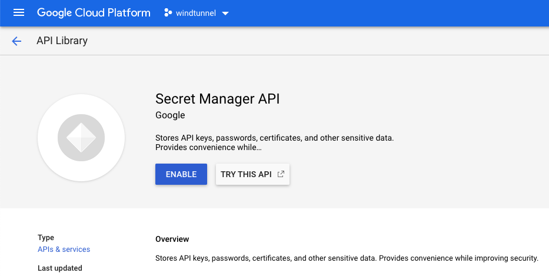
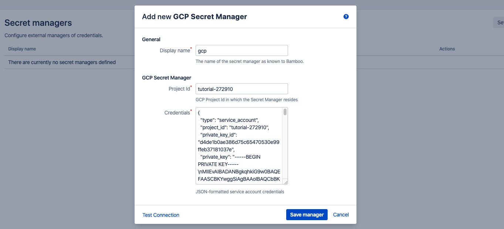

# GCP Secret Manager

- [Introduction](/tutorials/gsm?id=introduction)
- [GCP Setup](/tutorials/gsm?id=gcp-setup)
    - [Create a Project](/tutorials/gsm?id=create-a-project)
    - [Enable Secret Manager API](/tutorials/gsm?id=enable-secret-manager-api)
    - [Create a Service Account](/tutorials/gsm?id=create-a-service-account)
    - [Define a Secret](/tutorials/gsm?id=define-a-secret)
- [Bamboo Setup](/tutorials/gsm?id=bamboo-setup)
    - [Add GCP Secret Manager](/tutorials/gsm?id=add-gcp-secret-manager)
    - [Define Secret Variable](/tutorials/gsm?id=define-secret-variable)
- [Testing](/tutorials/gsm?id=testing)

## Introduction

This tutorial demonstrates how to get started with [Secret Managers for Bamboo](https://marketplace.atlassian.com/1221965)
and the [GCP Secret Manager](https://cloud.google.com/secret-manager).

We assume a *Google Cloud Platform (GCP)* account at https://console.cloud.google.com. If you have no such account yet, please head over to https://cloud.google.com and create one first.

> Depending on our GCP subscription and actual usage, following along with this tutorial could incur some (minimal) costs. Please refer to the GCP Secret Manager pricing page at https://cloud.google.com/secret-manager/pricing for details.

## GCP Setup

### Create a Project

Once signed in into the GCP console, browse to https://console.cloud.google.com/projectcreate.

> For completeness sake, a new project is created for this tutorial. You are free to skip this step and re-use an existing project.

Complete the requested details. Take note of the (generated) *Project ID*, tutorial-272910 in this example, as it will be needed during Bamboo setup.

<kbd></kbd>

Click *CREATE*. After a few moments, the project is ready and can be selected from the *Notifications* menu in the top-right.

<kbd></kbd>

Select *View project* to ensure a correct context for the rest of this tutorial.

### Enable Secret Manager API

Select *API & Services* > *Library* from the top-left menu.

<kbd></kbd>

Search for, and select the *Secret Manager API* result.

<kbd></kbd>

Click the *ENABLE* button to activate the API.

<kbd></kbd>

Once ready, you are redirected to the Secret Manager API management page.

### Create a Service Account

We will now create a [*Service Account*](https://cloud.google.com/iam/docs/understanding-service-accounts),
which is the system account under which Bamboo will authenticate with GCP, and authorize against the enabled Secret Manager.

Click the *Credentials* item in the left menu.

<kbd></kbd>

Click *CREATE CREDENTIALS* in the top menu, and select *Service account*.

<kbd></kbd>

Complete the first page of the wizard as shown. The service account name and ID can be chosen at will. Click *CREATE* to proceed.

<kbd></kbd>

On the second page, we will grant the service account read rights over the secrets defined in the Secret Manager by means of
assigning the pre-defined *Secret Manager Secret Accessor* role. Search for, and assign this role using the *Select a role* input.

<kbd></kbd>

Click *CONTINUE* to proceed. The second page should look as shown.

<kbd></kbd>

On the final page, we will create the key material used by Bamboo. Click the *CREATE KEY* button.

<kbd></kbd>

In the side panel on the right, leave the key in the recommended JSON format and confirm by clicking *CREATE*.

<kbd></kbd>

As a result, GCP will download a JSON file to your computer. This file contains the credentials of the service account,
and will be used when configuring Bamboo.

### Define a Secret

Select *Security* > *Secret Manager* from the top-left menu. Click through on *CREATE SECRET*.

<kbd></kbd>

Enter a secret name and value, and optionally define a region as shown. Click *CREATE SECRET* to confirm.

> GCP secret names can only contain English letters (A-Z), numbers (0-9), dashes (-), and underscores (_). This is in line with the
> restrictions imposed by the *Secret Managers for Bamboo* plugin on secret names. Any valid GCP secret name is as such a valid *Secret Managers for Bamboo* secret name as well.

<kbd></kbd>

The secret detail page is shown. Confirm the role of the service account in the side panel on the right.  

<kbd></kbd>

*GCP* setup is hereby complete.

## Bamboo Setup

It is assumed the *Secret Managers for Bamboo* plugin has been successfully installed in your Bamboo
server installation. The plugin will add an administrative menu item *Secret managers* at the bottom of
the *Build Resources* section.

<kbd></kbd>

### Add GCP Secret Manager

On the *Secret managers* page, select *GCP Secret Manager* from the *Add new manager* drop-down in the upper-right.
The *Add new GCP Secret Manager* dialog appears.

<kbd></kbd>

Complete the fields as indicated:

- *Display name*: this name is Bamboo-specific. It will appear on the *Secret managers* overview page, and is used to refer to the secrets held by this secret manager from Bamboo variable values. It can only contain 0-9, a-z, A-Z, and - (dash) characters.
- *Project ID*: this is the Project ID of the GCP project under which the secret manager was defined. Not to be confused with the Project Name which may or may not be distinct.
- *Credentials*: should hold the contents of the service account key, as previously created, in JSON format.

Before the manager is saved, the connection can be tested. When the connection fails, hover over the crossmark icon to reveal the cause.

<kbd></kbd>

> It is important to understand that the 'Test Connection' functionality is not bulletproof, as none of the secret names are known to
> Bamboo at this point. Only some basic checks are performed on the provided data. The actual secret resolution only happens at
> build time, which can still fail for a number of reasons.

Once the manager is saved, it is shown in the overview from where it can be edited and deleted.

### Define Secret Variable

We can now refer to the *GCP Secret Manager* secrets from Bamboo global, project, plan or environment variables.
As an example, we define our secret as a plan variable in the screenshot below.

<kbd></kbd>

The value of the *DatabaseConnection* variable refers to the *GCP Secret Manager* secret using the special syntax:

```
%<secret-manager-name>:<secret-path>%
```

Which in our case becomes:

```
%gcp:database-connection%
```

For GCP Secret Manager, the *secret-path* always equals the secret name as define in GCP, as Secret Manager does not allow secret hierarchies.

See the [variable syntax](/topics/syntax.md) page for additional details.

## Testing

As the secret is defined as a regular Bamboo variable, all existing use-cases regarding Bamboo variables apply.
For additional information, please refer to [the following Bamboo article](https://confluence.atlassian.com/bamboo/bamboo-variables-289277087.html).

To test our configuration, we define a simple script task printing our variable to the logs, as depicted in the screenshot below.

<kbd></kbd>

When running this plan, the logs will mention the *Secrets Resolver* pre-build action, 
which ad hoc resolves our secrets through the defined secret managers. The actual secret value only exists in memory for the duration of the build or deployment.

<kbd></kbd>

The plugin will also ensure that the secrets are never revealed in the logs.