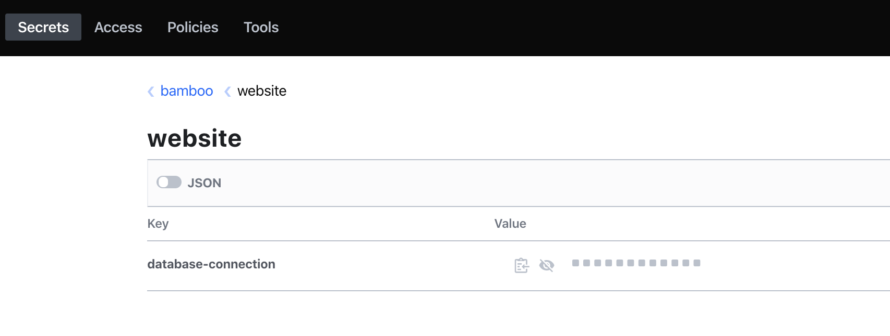
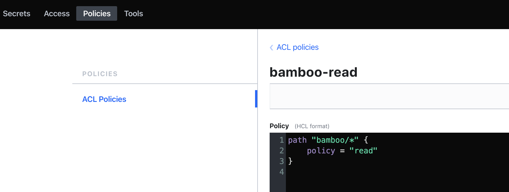
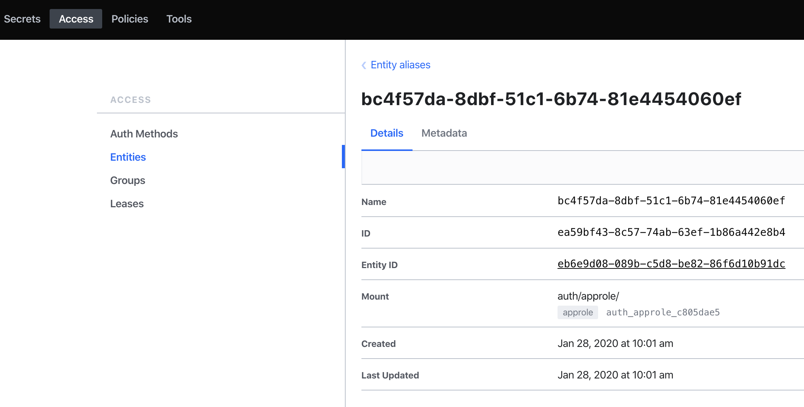
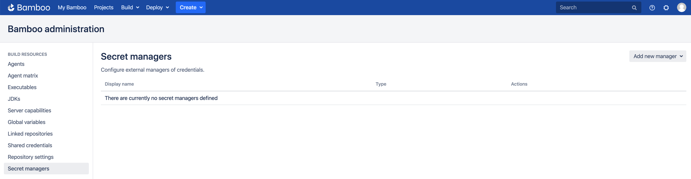
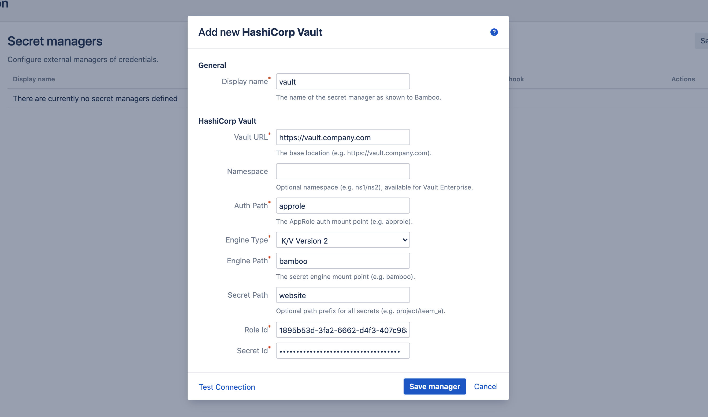
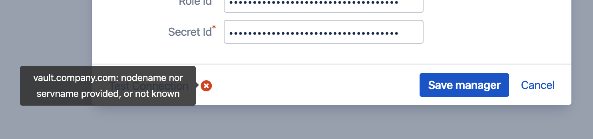
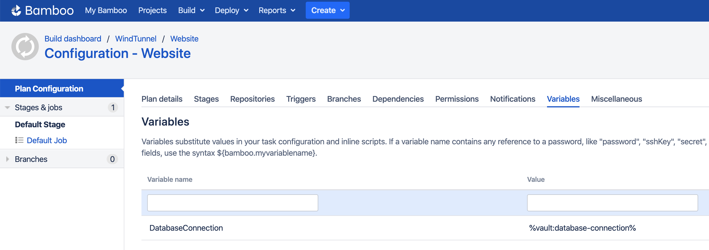
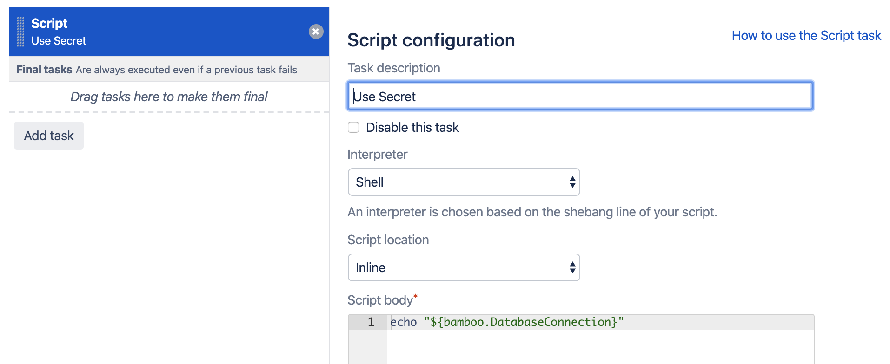
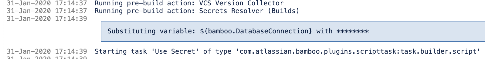

# HashiCorp Vault

- [Introduction](/tutorials/hcv?id=introduction)
- [Vault Setup](/tutorials/hcv?id=vault-setup)
    - [Enable the Engine](/tutorials/hcv?id=enable-the-engine)
    - [Define a Secret](/tutorials/hcv?id=define-a-secret)
    - [Define a Policy](/tutorials/hcv?id=define-a-policy)
    - [Create an AppRole](/tutorials/hcv?id=create-an-approle)
- [Bamboo Setup](/tutorials/hcv?id=bamboo-setup)
    - [Add HashiCorp Vault Manager](/tutorials/hcv?id=add-hashicorp-vault-manager)
    - [Define Secret Variable](/tutorials/hcv?id=define-secret-variable)
- [Testing](/tutorials/hcv?id=testing)

## Introduction

This tutorial demonstrates how to get started with [Secret Managers for Bamboo](https://marketplace.atlassian.com/1221965) and
[HashiCorp Vault](https://www.vaultproject.io/), henceforth abbreviated as just *Vault*.

We assume a running, unsealed *Vault* server installation with administrative access, accessible from your Bamboo server installation.
If this is not the case, kindly consult the [Vault documentation](https://www.vaultproject.io/docs/install/) first.

> For this tutorial, we assume the *Vault* server resides at https://vault.company.com. 
> Please adjust the provided instructions as needed.

This tutorial uses the CLI to access and configure *Vault*. Although the server comes with a web-based UI,
not all installations have it enabled and it furthermore does not allow to perform all required configurations.
However, the state of the system will be illustrated with screenshots from the UI where applicable.

## Vault Setup

### Enable the Engine

Enable a new *K/V Secrets Engine* on the path 'bamboo'. Both [K/V version 1](https://www.vaultproject.io/docs/secrets/kv/kv-v1)
and [K/V version 2](https://www.vaultproject.io/docs/secrets/kv/kv-v2) are supported, so execute one of the following commands:

```
# For K/V version 1
vault secrets enable -version=1 -path=bamboo kv

# For K/V version 2
vault secrets enable -version=2 -path=bamboo kv
```

Resulting in the output:

```
Success! Enabled the kv secrets engine at: bamboo/
```

### Define a Secret

We will use this engine to store the secret *database-connection* with value *supersecret* below the path *website*:

```
vault kv put bamboo/website database-connection=supersecret
```

> *Vault* is quite liberal when it comes to naming paths and (secret) keys. Essentially everything is allowed except for the special '/' path character.
> However, in order to cater for the restrictions in other secret managers, the *Secret Managers for Bamboo* plugin only 
> accepts alphanumeric characters, dashes and underscores. As such, *database-connection*, *DATABASE_CONNECTION* and *DbConn001* are all valid.
> Please name your entities in *Vault* accordingly.

Resulting in the output (for K/V v2):

```
Key              Value
---              -----
created_time     2020-01-31T18:19:00.991173984Z
deletion_time    n/a
destroyed        false
version          1
```

The web-UI should display the following:

<kbd></kbd>

### Define a Policy

Create the file *bamboo-policy.hcl* with the content below. This policy grants read rights over all paths below 'bamboo'.

```
path "bamboo/*" {
    policy = "read"
}
```

Upload the policy with the following command:

```
vault policy write bamboo-read ./bamboo-policy.hcl
```

Resulting in the output:

```
Success! Uploaded policy: bamboo-read
```

Which can again be validated from the web-UI:

<kbd></kbd>

### Create an AppRole

We will now create an *AppRole*, which is the system account under which Bamboo will authenticate with *Vault*,
and authorize against the *bamboo* engine by means of the *bamboo-read* policy. Additional information can be found at
https://www.vaultproject.io/docs/auth/approle.

Ensure the AppRole Auth Method is enabled below the default *approle* path:

```
vault auth enable approle
```

Create a new AppRole named *bamboo*, with the *bamboo-read* policy as defined previously:

```
vault write auth/approle/role/bamboo policies=bamboo-read period=10m
```

We can now fetch the AppRole *Role Id* and *Secret Id*, which act as username and password.
Take note of these values, as they are needed when configuring Bamboo later on.

Role Id:

```
vault read auth/approle/role/bamboo/role-id
```

Resulting in:

```
Key        Value
---        -----
role_id    bc4f57da-8dbf-51c1-6b74-81e4454060ef
```

Secret Id:

```
vault write -f auth/approle/role/bamboo/secret-id
```

Resulting in:

```
Key                   Value
---                   -----
secret_id             9f4b03d1-13ac-a111-420a-c8f29a2dd0ba
secret_id_accessor    f8796c3b-48d3-a269-759d-7492a1bad24b
```

The creation of the AppRole can again be verified from the web-UI:

<kbd></kbd>

*Vault* setup is hereby complete.

## Bamboo Setup

It is assumed the *Secret Managers for Bamboo* plugin has been successfully installed in your Bamboo
server installation. The plugin will add an administrative menu item *Secret managers* at the bottom of
the *Build Resources* section.

<kbd></kbd>

### Add HashiCorp Vault Manager

On the *Secret managers* page, select *HashiCorp Vault* from the *Add new manager* drop-down in the upper-right.
The *Add new HashiCorp Vault* dialog appears.

<kbd></kbd>

Complete the fields as indicated:

- *Display name*: this name is Bamboo-specific. It will appear on the *Secret managers* overview page, and is used to refer to the secrets held by this secret manager from Bamboo variable values. It can only contain 0-9, a-z, A-Z, and - (dash) characters.
- *Vault URL*: the base URL of your *Vault* server installation.
- *Namespace*: allows scoping requests against a *Vault* [namespace](https://www.vaultproject.io/docs/enterprise/namespaces). Namespaces are an enterprise feature, and will have no effect when used against a non-enterprise installation of *Vault*. The details of namespacing are outside the scope of this tutorial.
- *Auth Path*: the path at which AppRole Auth Method is mounted, we used the default *approle*.
- *Engine Type*: the secrets engine type, one of *K/V Version 1* or K/V Version 2.
- *Engine Path*: the path at which the *Secrets Engine* is mounted, we used *bamboo*.
- *Secret Path*: this field is optional and can be left blank. 
When defined, its value is prefixed to the path of each secret referenced by this secret manager. 
In our example, we defined the secret *website/database-connection* below the *bamboo* engine in *Vault*. 
If we use *website* as value for this field, we can refer to the secret as just *database-connection*, otherwise we will need the full path (i.e. *website/database-connection*) everywhere this secret is used.
- *Role Id*: the AppRole role-id value as defined.
- *Secret Id*: the AppRole secret-id as defined.

Before the manager is saved, the connection can be tested. When the connection fails, hover over the crossmark icon to reveal the cause.

<kbd></kbd>

> It is important to understand that the 'Test Connection' functionality is not bulletproof, as none of the secret names are known to
> Bamboo at this point. Only some basic checks are performed on the provided data. The actual secret resolution only happens at
> build time, which can still fail for a number of reasons.

Once the manager is saved, it is shown in the overview from where it can be edited and deleted.

### Define Secret Variable

We can now refer to the *Vault* secrets from Bamboo global, project, plan or environment variables.
As an example, we define our secret as a plan variable in the screenshot below.

<kbd></kbd>

The value of the *DatabaseConnection* variable refers to the *Vault* secret using the special syntax:

```
%<secret-manager-name>:<secret-path>%
```

Which in our case becomes:

```
%vault:database-connection%
```

As explained above, if the *Secret Path* field would have been left empty in the *Add new HashiCorp Vault* dialog, the
secret must be referenced as follows:

```
%vault:website/database-connection%
```

See the [variable syntax](/topics/syntax.md) page for additional details.

## Testing

As the secret is defined as a regular Bamboo variable, all existing use-cases regarding Bamboo variables apply.
For additional information, please refer to [the following Bamboo article](https://confluence.atlassian.com/bamboo/bamboo-variables-289277087.html).

To test our configuration, we define a simple script task printing our variable to the logs, as depicted in the screenshot below.

<kbd></kbd>

When running this plan, the logs will mention the *Secrets Resolver* pre-build action, 
which ad hoc resolves our secrets through the defined secret managers. The actual secret value only exists in memory for the duration of the build or deployment.

<kbd></kbd>

The plugin will also ensure that the secrets are never revealed in the logs.
