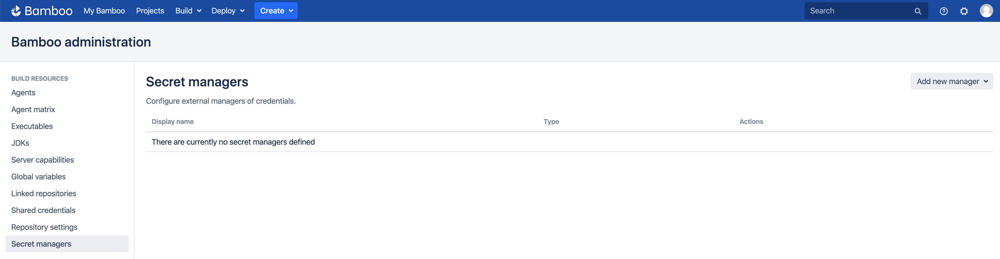
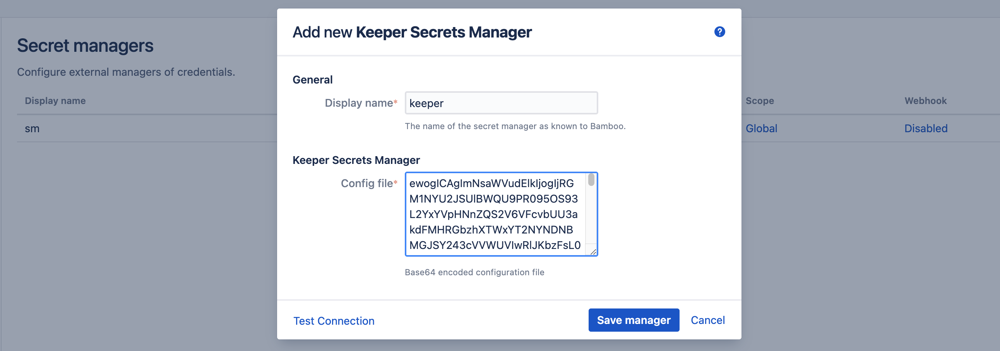

# Keeper Secrets Manager

- [Introduction](/tutorials/ksm?id=introduction)
- [Keeper Setup](/tutorials/ksm?id=keeper-setup)
- [Bamboo Setup](/tutorials/ksm?id=bamboo-setup)
    - [Add Keeper Secrets Manager](/tutorials/ksm?id=add-keeper-secrets-manager)
    - [Define Secret Variable](/tutorials/ksm?id=define-secret-variable)
- [Testing](/tutorials/ksm?id=testing)

## Introduction

This tutorial demonstrates how to get started with [Secret Managers for Bamboo](https://marketplace.atlassian.com/1221965) and [Keeper Secrets Manager](https://www.keepersecurity.com/secrets-manager.html).

## Keeper Setup

Please refer to the setup as documented in the Keeper Secrets Manager [Quick Start Guide](https://docs.keeper.io/en/v/secrets-manager/secrets-manager/quick-start-guide).

This tutorial will only deviate from and detail the setup of the Vault itself.

Create a new shared folder to be used by Bamboo. No user permissions are needed, and the record permissions should be set to *View Only*.

<kbd></kbd>

Next, create a Secrets Manager *Application* and grant *Read Only* permissions over the *Bamboo Secrets* folder.

<kbd></kbd>

Copy the provided application *Access Token*...

<kbd></kbd>

...and execute the following command on the Keeper CLI to generate the (base64 encoded) config file:

```bash
ksm init default EU:U7Qi5pSBazXZXc9RFwuO8ox1X-ebkEmv7jVpoFlxFyE
```

The resulting value will be used when setting up Bamboo, e.g.

```
ewogICAgImNsaWVudElk....MXovUDhpYUorNmJPTzBoQ0F2VkPbzAraVJRTT0iCn0=
```

Finally, create a record of type *Login* in the *Bamboo Secrets* folder.

<kbd></kbd>

Provide a value for the *Login* and *Password* fields, as shown below.

<kbd></kbd>

## Bamboo Setup

It is assumed the *Secret Managers for Bamboo* plugin has been successfully installed in your Bamboo
server installation. The plugin will add an administrative menu item *Secret managers* at the bottom of
the *Build Resources* section.

<kbd></kbd>

### Add Keeper Secrets Manager

On the *Secret managers* page, select *Keeper Secrets Manager* from the *Add new manager* drop-down in the upper-right.
The *Add new Keeper Secrets Manager* dialog appears.

<kbd></kbd>

Complete the fields as indicated:

- *Display name*: this name is Bamboo-specific. It will appear on the *Secret managers* overview page, and is used to refer to the secrets held by this secret manager from Bamboo variable values. It can only contain 0-9, a-z, A-Z, and - (dash) characters.
- *Config file*: the base64-encoded value of the configuration file, as previously generated on the CLI from the (one-time) application access token.

Before the manager is saved, the connection can be tested. When the connection fails, hover over the crossmark icon to reveal the cause.

> It is important to understand that the 'Test Connection' functionality is not bulletproof, as none of the secret names are known to
> Bamboo at this point. Only some basic checks are performed on the provided data. The actual secret resolution only happens at
> build time, which can still fail for a number of reasons.

Once the manager is saved, it is shown in the overview from where it can be edited and deleted.

### Define Secret Variable

We can now refer to the Keeper Secrets Manager secret fields from Bamboo global, project, plan or environment variables.
As an example, we define our secret as a plan variable in the screenshot below.

<kbd></kbd>

The value of the *DatabaseConnection* variable refers to the Keeper secret using the special syntax:

```
%<secret-manager-name>:<secret-path>%
```

Which in our case becomes:

```
%keeper:database-user%
```

This will resolve the value of the *Password* field of the record with title *database-user*. This is the default behavior.
If we would like to resolve the value of the *Login* field instead, an additional *discriminator* value is needed as follows:

```
%keeper:database-user:login%
```

See the [variable syntax](/topics/syntax.md) page for additional details.

## Testing

As the secret is defined as a regular Bamboo variable, all existing use-cases regarding Bamboo variables apply.
For additional information, please refer to [the following Bamboo article](https://confluence.atlassian.com/bamboo/bamboo-variables-289277087.html).

To test our configuration, we define a simple script task printing our variable to the logs, as depicted in the screenshot below.

<kbd></kbd>

When running this plan, the logs will mention the *Secrets Resolver* pre-build action,
which ad hoc resolves our secrets through the defined secret managers. The actual secret value only exists in memory for the duration of the build or deployment.

<kbd></kbd>

The plugin will also ensure that the secrets are never revealed in the logs.
