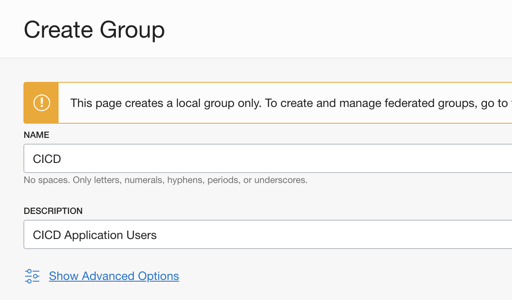
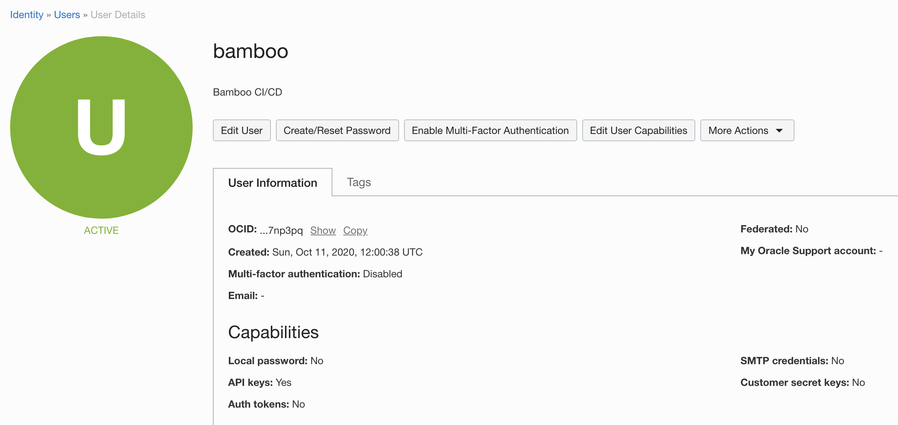

# Oracle Cloud Vault

- [Introduction](/tutorials/ocv?id=introduction)
- [OCI Setup](/tutorials/ocv?id=oci-setup)
    - [Tenancy Details](/tutorials/ocv?id=tenancy-details)
    - [Create a Compartment](/tutorials/ocv?id=create-a-compartment)
    - [Create a Vault](/tutorials/ocv?id=create-a-vault)
    - [Define a Secret](/tutorials/ocv?id=define-a-secret)
    - [Create a Group](/tutorials/ocv?id=create-a-group)
    - [Define a Policy](/tutorials/ocv?id=define-a-policy)
    - [Create a User](/tutorials/ocv?id=create-a-user)
- [Bamboo Setup](/tutorials/ocv?id=bamboo-setup)
    - [Add Oracle Cloud Vault](/tutorials/ocv?id=add-oracle-cloud-vault)
    - [Define Secret Variable](/tutorials/ocv?id=define-secret-variable)
- [Testing](/tutorials/ocv?id=testing)

## Introduction

This tutorial demonstrates how to get started with [Secret Managers for Bamboo](https://marketplace.atlassian.com/1221965)
and [Oracle Cloud Infrastructure (OCI) Vault](https://www.oracle.com/security/cloud-security/key-management).

If you do not have an OCI account yet, please head over to https://signup.oraclecloud.com and create one first.
Sign in to the OCI console to start this tutorial.

## OCI Setup

### Tenancy Details

As part of creating your OCI account, the root compartment (i.e. the *tenancy*) was created and the *home region* selected.
The tenancy Oracle Cloud ID (OCID) and the home region name are needed when configuring Bamboo later on, and can be found on
the *Administration > Tenancy Details* screen accessible from the main console menu.

<kbd></kbd>

### Create a Compartment

We will create a sub-compartment to host the vault holding the secrets accessible to Bamboo. From the main menu, select
*Identity > Compartments*. Click the *Create Compartment* button on top and set an appropriate name and description, as
shown in the screenshot below. Write down the OCID of the compartment, as it will be needed later on.

<kbd></kbd>

### Create a Vault

From the main menu, select *Security > Vault*. Click the *Create Vault* button on top. Select the previously created
compartment, give the vault a name of choice and confirm. The vault might take a few minutes to reach the active state.
Write down the OCID of the vault, as it will be needed later on.

<kbd></kbd>

Once the vault is ready, create a *master encryption key* which will be used to encrypt the secrets at rest. Select
*Master Encryption Keys* below *Resources* in the menu on the left, and click the *Create Key* button. Complete the details
as shown in the screenshot below, and confirm.

<kbd></kbd>

### Define a Secret

Still on the *Vault Details* page, select *Secrets* below *Resources* in the menu on the left and click the *Create Secret* button.
Complete the details as shown in the screenshot below, and confirm.

> OCI secret names can contain alphanumeric characters, underscores, hyphens and spaces. However, in order to cater for the restrictions
> in other secret managers, the *Secret Managers for Bamboo* plugin only accepts alphanumeric characters, dashes and underscores.
> Please name your entities in OCI accordingly, and avoid using spaces.

<kbd></kbd>

### Create a Group

Before we can define a policy which allows read access to the secrets of the vault, we need to create a group to which the policy will
be applied. From the main menu, select *Identity > Groups*. Click the *Create Group* button on top, complete the details as shown and confirm.

<kbd></kbd>

### Define a Policy

From the main menu, select *Identity > Policies*. Click the *Create Policy* button on top. The listing below represents the minimum
rights needed to list the vault secrets and read the secret values from the vault. The policy is strictly scoped to the vault defined
before by using a *where* clause using the vault OCID. More relaxed policies are possible by dropping this clause.

```
Allow group CICD to read secret-family in compartment windtunnel where target.vault.id = 'ocid1.vault.oc1.eu-frankfurt-1.bfpyfupxaaaao.abtheljsjtbidjgotbgl727qkvzlp2g26yzxr2fsldvrw65hebkbmynbreuqz'
```

Adjust the OCID as needed, and complete the policy as shown in the screenshot below.

<kbd></kbd>

### Create a User

As a final step, we can now create the User which will be used by Bamboo to access the vault. From the main menu, select *Identity > Users*.
Click the *Create User* button on top. Because this is an application user, we leave the *email* fields empty.

<kbd></kbd>

Once the user is created, take note of the OCID as it will be needed later on.

<kbd></kbd>

Next, click the *Edit User Capabilities* button on top of the *User Details* page. We will restrict the capabilities of this user to only
allow API-based access, as shown below.

<kbd></kbd>

Select *Groups* from the *Resources* menu on the left and add this user to the previously defined *CICD* group.

Finally, click *API Keys* from the *Resources* menu on the left and click *Add Public Key*. Generate a key pair locally using the
instructions below, and upload or paste the public key in the OCI interface. Once the key is saved, take note of the *fingerprint* as
it will be needed later on.

```
# private key with password
$ openssl genrsa -out bamboo_api_key.pem -aes128 2048

# private key without password
$ openssl genrsa -out bamboo_api_key.pem 2048

# public key 
$ openssl rsa -pubout -in bamboo_api_key.pem -out bamboo_api_key_public.pem
``` 

> OCI uses public-private key pairs to sign API requests on behalf of a user. Additional instructions
> can be found at https://docs.cloud.oracle.com/en-us/iaas/Content/API/Concepts/apisigningkey.htm#two.

<kbd></kbd>

*OCI* setup is herby complete.

## Bamboo Setup

It is assumed the *Secret Managers for Bamboo* plugin has been successfully installed in your Bamboo
server installation. The plugin will add an administrative menu item *Secret managers* at the bottom of
the *Build Resources* section.

<kbd></kbd>

### Add Oracle Cloud Vault

On the *Secret managers* page, select *Oracle Cloud Vault* from the *Add new manager* drop-down in the upper-right.
The *Add new Oracle Cloud Vault* dialog appears.

<kbd></kbd>

Complete the fields as indicated:

- *Display name*: this name is Bamboo-specific. It will appear on the *Secret managers* overview page, and is used to refer to the secrets held by this secret manager from Bamboo variable values. It can only contain 0-9, a-z, A-Z, and - (dash) characters.
- *Region*: the OCI region hosting the vault.
- *Tenancy Id*: the OCID of your account tenancy.
- *Compartment Id*: the OCID of the compartment hosting the vault.
- *Vault Id*: the OCID of the vault.
- *User Id*: the OCID of the application user accessing the vault.
- *Private Key*: the contents of the private key file as generated above.
- *Key Password*: the password of the private key. When no password was defined, leave this field empty.
- *Key Fingerprint*: the key fingerprint (as shown in the OCI console) in MD5 hash format.

Before the manager is saved, the connection can be tested. When the connection fails, hover over the crossmark icon to reveal the cause.

<kbd></kbd>

Once the manager is saved, it is shown in the overview from where it can be edited and deleted.

### Define Secret Variable

We can now refer to the *Oracle Cloud Vault* secrets from Bamboo global, project, plan or environment variables.
As an example, we define our secret as a plan variable in the screenshot below.

<kbd></kbd>

The value of the *DatabaseConnection* variable refers to the *Oracle Cloud Vault* secret using the special syntax:

```
%<secret-manager-name>:<secret-path>%
```

Which in our case becomes:

```
%oracle:database-connection%
```

See the [variable syntax](/topics/syntax.md) page for additional details.

## Testing

As the secret is defined as a regular Bamboo variable, all existing use-cases regarding Bamboo variables apply.
For additional information, please refer to [the following Bamboo article](https://confluence.atlassian.com/bamboo/bamboo-variables-289277087.html).

To test our configuration, we define a simple script task printing our variable to the logs, as depicted in the screenshot below.

<kbd></kbd>

When running this plan, the logs will mention the *Secrets Resolver* pre-build action, 
which ad hoc resolves our secrets through the defined secret managers. The actual secret value only exists in memory for the duration of the build or deployment.

<kbd></kbd>

The plugin will also ensure that the secrets are never revealed in the logs.