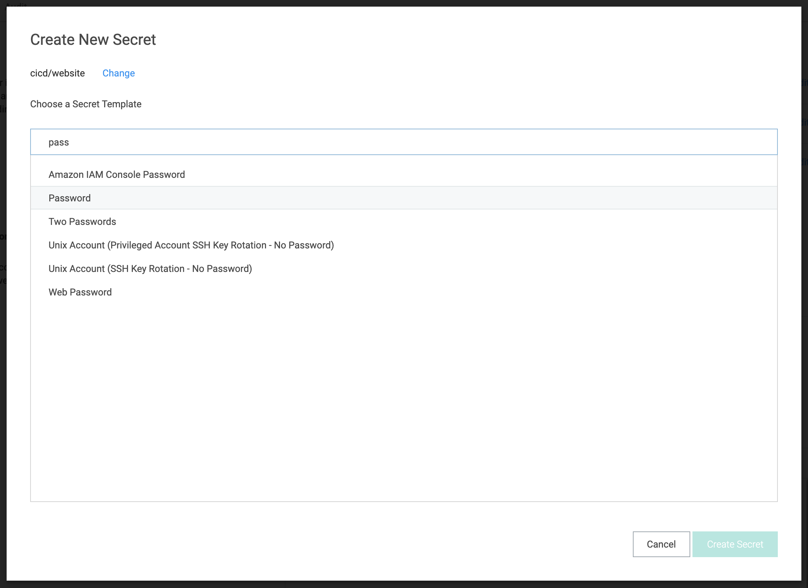

# Thycotic Secret Server

- [Introduction](/tutorials/tss?id=introduction)
- [Secret Server Setup](/tutorials/tss?id=secret-server-setup)
    - [Enable Webservices](/tutorials/tss?id=enable-webservices)
    - [Create Application Account](/tutorials/tss?id=create-application-account)
    - [Define Folder Hierarchy](/tutorials/tss?id=define-folder-hierarchy)
    - [Define a Secret](/tutorials/tss?id=define-a-secret)
- [Bamboo Setup](/tutorials/tss?id=bamboo-setup)
    - [Add Thycotic Secret Server](/tutorials/tss?id=add-thycotic-secret-server)
    - [Define Secret Variable](/tutorials/tss?id=define-secret-variable)
- [Testing](/tutorials/tss?id=testing)

## Introduction

This tutorial demonstrates how to get started with [Secret Managers for Bamboo](https://marketplace.atlassian.com/1221965)
and [Thycotic Secret Server](https://thycotic.com/products/secret-server). Both the on-premises and cloud variants of *Secret Server* are supported.

## Secret Server Setup

### Enable Webservices

Go to the *Admin > Configuration* page and ensure webservices are enabled.

<kbd></kbd>

### Create Application Account

We will create an *Application Account* which can be used by Bamboo to access the server. Go to the *Admin > Users* page and click *Create new*.
Complete the details as shown in the screenshot below. Choose a strong password, and ensure the *Application Account* checkbox is selected below *Advanced*.

<kbd></kbd>

Save the user, and confirm the *Convert to Application Account* dialog.

### Define Folder Hierarchy

Next, use the top-level menu on the home page to create a new folder.

<kbd></kbd>

Name the folder *cicd*, and ensure it is located at the root of the hierarchy.

<kbd></kbd>

Repeat the process to create a sub-folder of the *cicd* folder named *website*. The folder hierarchy in the side menu should look as depicted below.

<kbd></kbd>

### Set Folder Permissions

The *Bamboo Application Account* should receive permissions to *View* (i.e. read) all secrets in the *website* folder created above.
Select the *website* folder, and click *Edit* from the dropdown menu in the breadcrumbs on top.

<kbd></kbd>

Next to *Folder Permissions*, click *Edit*. Deselect *Inherit Permissions* if needed, add the Bamboo user to the *Selected Groups* and assign
*View* permissions both on the Folder as well as the Secrets.

<kbd></kbd>

Save the changes when done.

### Define a Secret

Finally, use the top-level menu on the home page to create a new secret. Ensure the *cicd/website* folder is selected, and choose the *Password* template.

<kbd></kbd>

Complete the secret details as shown below. Only the secret name and password are needed, all other fields can be left empty. 

<kbd></kbd>

Save the secret when done. *Secret Server* setup is hereby complete.

## Bamboo Setup

It is assumed the *Secret Managers for Bamboo* plugin has been successfully installed in your Bamboo
server installation. The plugin will add an administrative menu item *Secret managers* at the bottom of
the *Build Resources* section.

<kbd></kbd>

### Add Thycotic Secret Server

On the *Secret managers* page, select *Thycotic Secret Server* from the *Add new manager* drop-down in the upper-right.
The *Add new Thycotic Secret Server* dialog appears.

<kbd></kbd>

Complete the fields as indicated:

- *Display name*: this name is Bamboo-specific. It will appear on the *Secret managers* overview page, and is used to refer to the secrets held by this secret manager from Bamboo variable values. It can only contain 0-9, a-z, A-Z, and - (dash) characters.
- *Secret Server URL*: the base URL of your *Secret Server*. This can be an internal/on-premises url or the url of your cloud tenant.
- *Secret Path*: this field is optional and can be left blank. When defined, its value is prefixed to the path of each secret referenced by this secret manager. In our example, we defined the secret *database-connection* below the *cicd/website* folder hierarcy.
If we use *cicd* as value for this field, we can refer to the secret as *website/database-connection*. If we use *cicd/website*, we can refer to the secret as just *database-connection*. If the field is left empty, we will need the full path (i.e. *cicd/website/database-connection*) everywhere this secret is used.
- *Username*: the username of the application account.
- *Password*: the password of the application account.

Before the manager is saved, the connection can be tested. When the connection fails, hover over the crossmark icon to reveal the cause.

<kbd></kbd>

> It is important to understand that the 'Test Connection' functionality is not bulletproof, as none of the secret names are known to
> Bamboo at this point. Only some basic checks are performed on the provided data. The actual secret resolution only happens at
> build time, which can still fail for a number of reasons.

Once the manager is saved, it is shown in the overview from where it can be edited and deleted.

### Define Secret Variable

We can now refer to the *Secret Server* secrets from Bamboo global, project, plan or environment variables.
As an example, we define our secret as a plan variable in the screenshot below.

<kbd></kbd>

The value of the *DatabaseConnection* variable refers to the *Secret Server* secret using the special syntax:

```
%<secret-manager-name>:<secret-path>%
```

Which in our case becomes:

```
%thycotic:database-connection%
```

As explained above, if the *Secret Path* field would have been left empty in the *Add new Thycotic Secret Server* dialog, the
secret must be referenced as follows:

```
%thycotic:cicd/website/database-connection%
```

See the [variable syntax](/topics/syntax.md) page for additional details.

## Testing

As the secret is defined as a regular Bamboo variable, all existing use-cases regarding Bamboo variables apply.
For additional information, please refer to [the following Bamboo article](https://confluence.atlassian.com/bamboo/bamboo-variables-289277087.html).

To test our configuration, we define a simple script task printing our variable to the logs, as depicted in the screenshot below.

<kbd></kbd>

When running this plan, the logs will mention the *Secrets Resolver* pre-build action, 
which ad hoc resolves our secrets through the defined secret managers. The actual secret value only exists in memory for the duration of the build or deployment.

<kbd></kbd>

The plugin will also ensure that the secrets are never revealed in the logs.