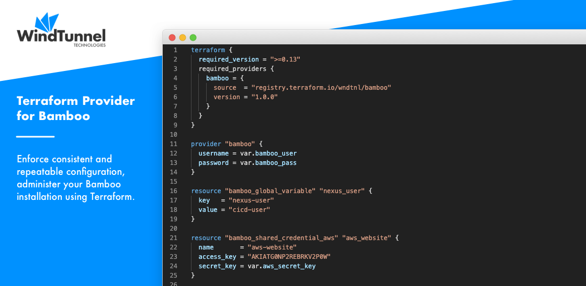

# Home

<kbd></kbd>

Take your DevOps practices to the next level and configure Bamboo from code.
As the perfect companion to [Bamboo Specs](https://confluence.atlassian.com/bamboo/bamboo-specs-894743906.html),
this plugin extends the [Bamboo API](https://docs.atlassian.com/atlassian-bamboo/REST/latest)
to unlock a range of additional administrative resources programmatically.

Combined with a production-grade and commercially supported Terraform provider, a consistent and repeatable environment can be ensured.

The following Terraform resources are currently available:

- Users
- Groups
- Global Permissions
- Global Variables
- Shared Credentials
- Local Agents
- Linked Repositories
- Linked Repository Permissions
- Projects
- Deployment Projects

The [provider](https://github.com/wndtnl/terraform-provider-bamboo) itself is open-sourced,
and can be found on the official [Terraform registry](https://registry.terraform.io/providers/wndtnl/bamboo/latest).

Having issues or missing a resource? Please [let us know](../common/support.md) and we’ll make it work.